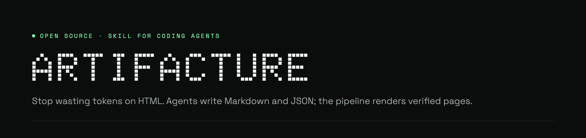
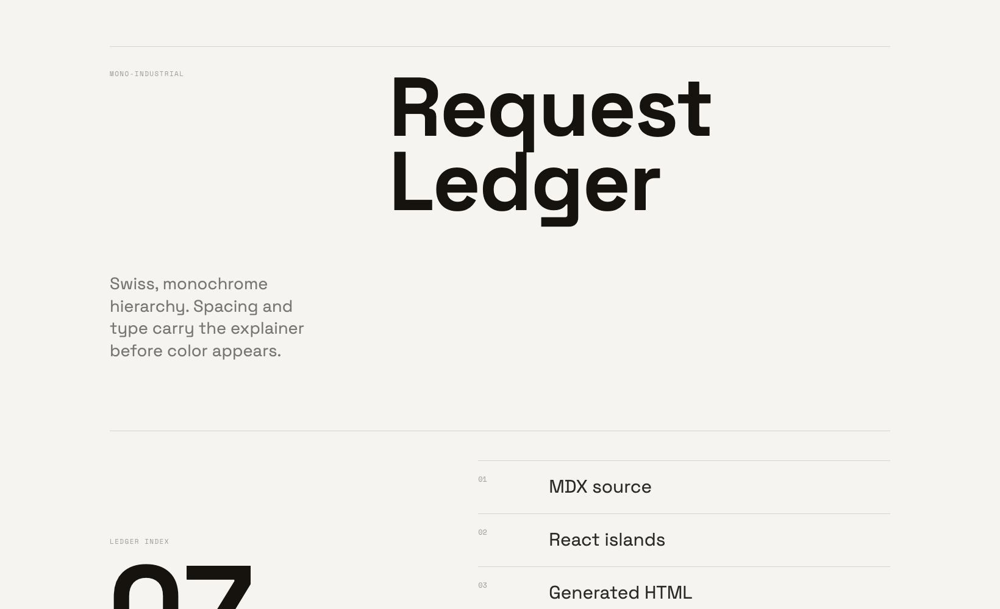
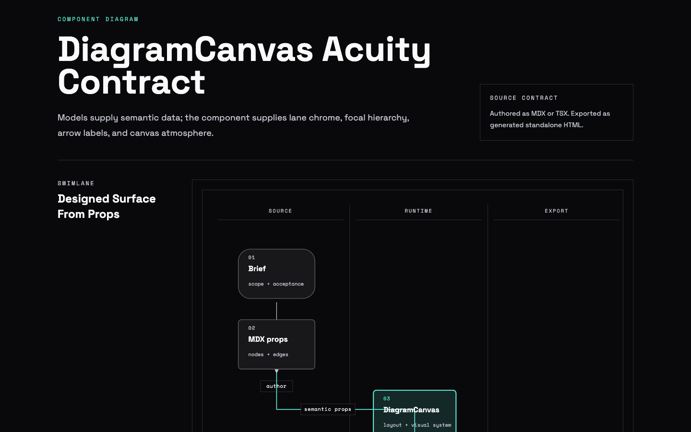
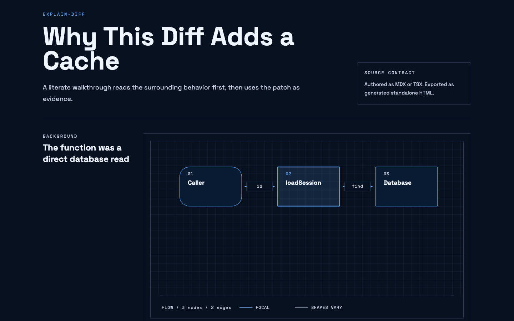
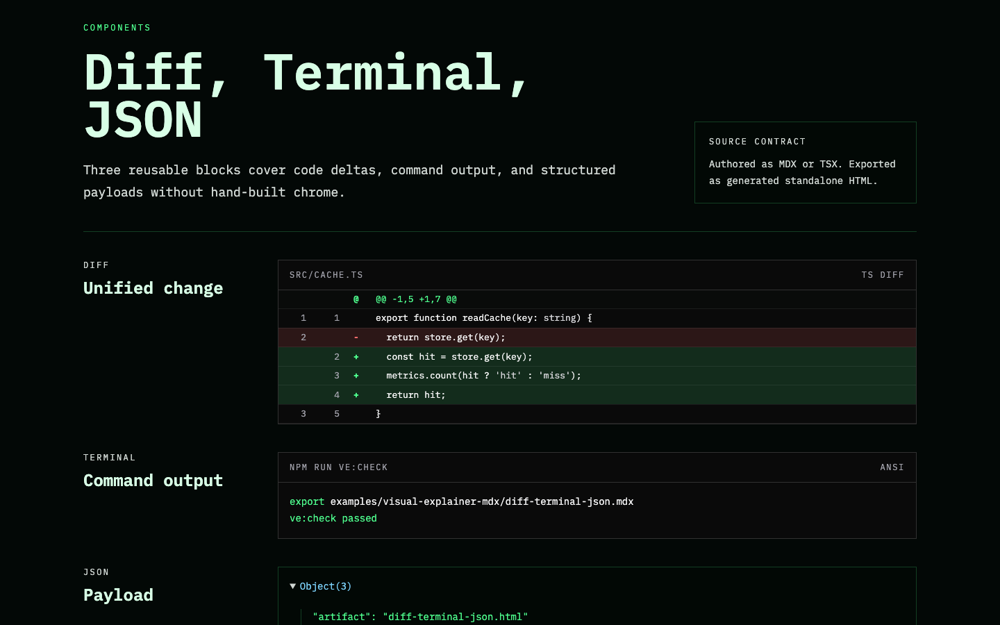
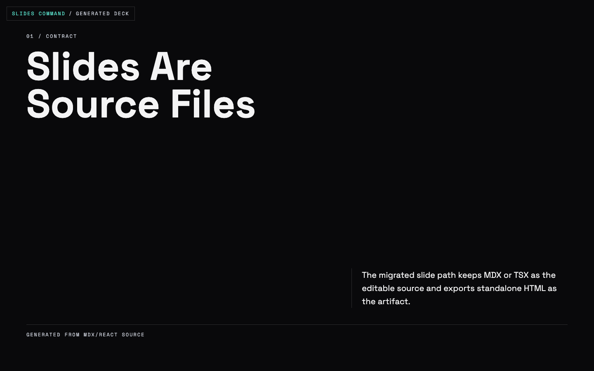
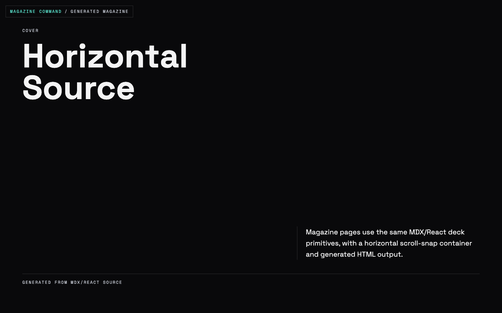
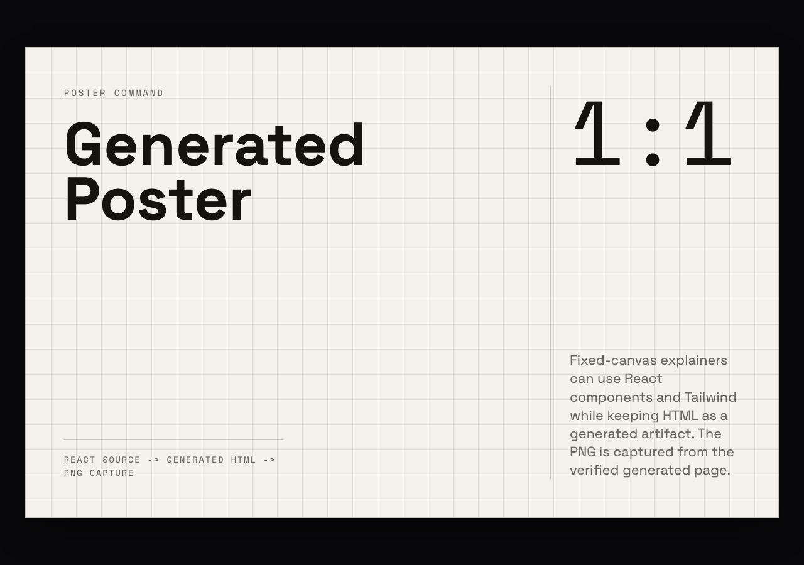
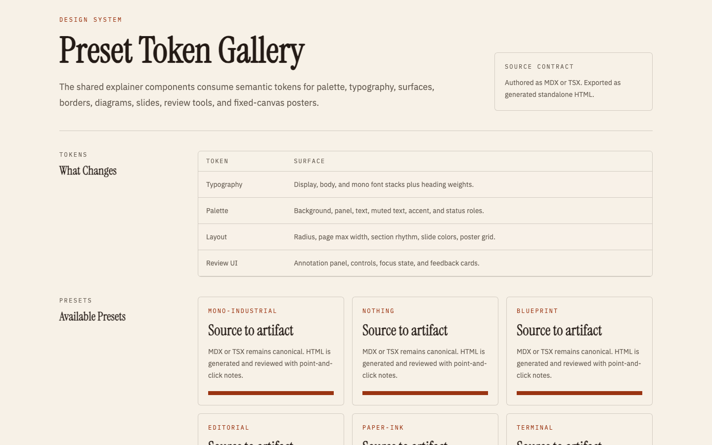
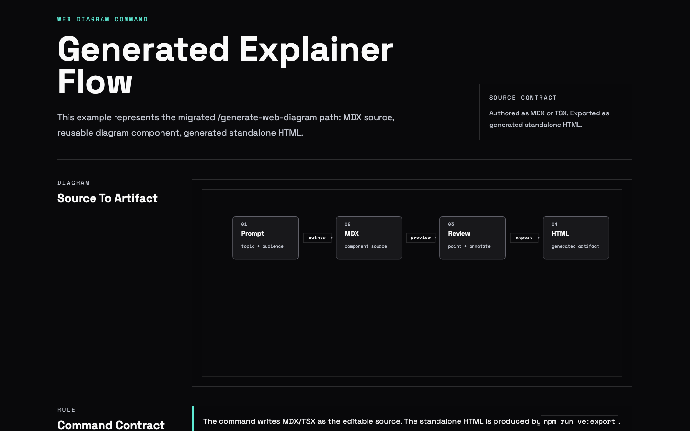

<p>
  
</p>

# Artifacture

**Verified visual explainers for coding agents.** Artifacture turns MDX/React sources into self-contained HTML artifacts: architecture diagrams, code walkthroughs, literate diff explainers, comparison tables, and slide decks. It then proves they hold up, with a deterministic 200+ check design-quality verifier (layout, contrast, responsiveness, AI-slop tells), small blind LLM rubric passes, and a multi-model eval harness. Kimi, GLM, DeepSeek, Claude, and Codex all produce passing output from the same ~3k-token authoring contract.

Artifacture began as a fork of [nicobailon/visual-explainer](https://github.com/nicobailon/visual-explainer) and preserves its spirit; see Credits below.

[](LICENSE)

Ask your agent to explain a system architecture, review a diff, or compare requirements against a plan. Instead of ASCII art and box-drawing tables, it authors MDX/React source, generates a self-contained HTML artifact, and opens it in your browser.

```
> draw a diagram of our authentication flow
> /visual-explainer:diff-review
> /visual-explainer:plan-review ~/docs/refactor-plan.md
> generate this in Blueprint style
```

<p align="center">
  <video src="demos/videos/longform-16x9.mp4" controls muted playsinline width="820"></video>
  <br>
  <em>Long-form explainer generated via <code>/generate-video --style=long-form</code>. Local render — no cloud, no API keys.</em>
</p>

<p align="center">
  
  <br>
  <em>Mono-Industrial — the default aesthetic. Space Grotesk display, Space Mono labels, optional Geist Pixel Square for one moment of surprise per page. Grayscale canvas, status colors only on values.</em>
</p>

<p align="center">
  
  <br>
  <em>Same page, dark mode. The aesthetic inverts cleanly through semantic role tokens — hierarchy stays anchored to type scale and spacing, never color.</em>
</p>

## Examples

Real output, deployed. Every link is an unedited artifact from the pipeline: one self-contained HTML file, view-source friendly. The full set lives at [claytonkim.com/artifacture-examples](https://claytonkim.com/artifacture-examples/index.html).

| | |
|---|---|
| [](https://claytonkim.com/artifacture-examples/architecture-canvas.html) <br> [**Architecture diagram**](https://claytonkim.com/artifacture-examples/architecture-canvas.html) · computed layout, linearizes on mobile | [](https://claytonkim.com/artifacture-examples/literate-diff.html) <br> [**Literate diff + quiz**](https://claytonkim.com/artifacture-examples/literate-diff.html) · background, walkthrough, comprehension check |
| [](https://claytonkim.com/artifacture-examples/code-blocks.html) <br> [**Diff / terminal / JSON blocks**](https://claytonkim.com/artifacture-examples/code-blocks.html) · build-time Shiki, ANSI, collapsible trees | [](https://claytonkim.com/artifacture-examples/slide-deck.html) <br> [**Slide deck**](https://claytonkim.com/artifacture-examples/slide-deck.html) · scroll-snap, keyboard nav, PDF export |
| [](https://claytonkim.com/artifacture-examples/magazine.html) <br> [**Magazine**](https://claytonkim.com/artifacture-examples/magazine.html) · horizontal full-bleed spreads | [](https://claytonkim.com/artifacture-examples/poster.html) <br> [**Poster**](https://claytonkim.com/artifacture-examples/poster.html) · fixed canvas, PNG export |
| [](https://claytonkim.com/artifacture-examples/preset-gallery.html) <br> [**Six presets**](https://claytonkim.com/artifacture-examples/preset-gallery.html) · one source, six locked aesthetics | [](https://claytonkim.com/artifacture-examples/architecture-diagram.html) <br> [**Explainer page**](https://claytonkim.com/artifacture-examples/architecture-diagram.html) · the default scrollable format |

Video formats (9:16 reel, 16:9 long-form) render to MP4 through Hyperframes; sample clips are in [docs/features.md](docs/features.md#4-video-output-via-hyperframes--explainer-mp4s-not-just-html).

## What it adds to upstream visual-explainer

- **ve-verify** (`scripts/verify/`): a 200+ check deterministic design-quality gate — static scans, real-browser measurement (390px overflow, WCAG contrast in both themes, Mermaid render), and small blind LLM rubric passes. Exit codes and JSON reports make it usable as a CI gate. Its own eval suite of seeded-violation fixtures proves each check fires.
- **Tiered agent docs**: SKILL.md is a ~2.5k-token bootstrap plus one ~300-token card per use case (`cards/`). A covered flow reads about 3,100 tokens instead of 62,000. Deep references load only on escalation.
- **17 shared components** (`visual-explainer-mdx/components.tsx`): DiagramCanvas with computed layout and CSS-only mobile linearization, build-time Shiki CodeBlock, DiffBlock, TerminalBlock, JsonTree, an interactive Quiz, MermaidBlock with zoom/pan chrome, decks, posters, and more. Strict-export integrity checks catch bad edge ids and undefined components at build time.
- **`/explain-diff`**: a literate diff mode (background → intuition → walkthrough → quiz), adapted from Geoffrey Litt's prompt pattern.
- **Model-matrix eval harness** (`evals/model-matrix/`): the same briefs across Kimi, GLM, DeepSeek, Claude, and Codex, scored on deterministic compliance plus a blind screenshot judge. Point it at your own model in about ten minutes.
- **One-command team sharing**: `share.sh` deploys to Vercel (zero setup, public) or sharehtml on Cloudflare (stable update-in-place URLs, team SSO via Cloudflare Access, comments). See `docs/TEAM-SHARING.md`.

## Install

**Claude Code (from this fork):**

```bash
git clone https://github.com/theclaymethod/artifacture.git
/plugin marketplace add ./artifacture
```

**Pi / OpenAI Codex:** same steps as upstream, point at this repo:

```bash
git clone --depth 1 https://github.com/theclaymethod/artifacture.git /tmp/artifacture
cp -r /tmp/artifacture/plugins/visual-explainer ~/.agents/skills/visual-explainer
rm -rf /tmp/artifacture
```

For the upstream project, see [nicobailon/visual-explainer](https://github.com/nicobailon/visual-explainer).

## Commands

| Command | What it does |
|---------|-------------|
| `/generate-web-diagram` | Generate an HTML diagram for any topic (inline SVG by default, Mermaid fallback) |
| `/generate-visual-plan` | Generate a visual implementation plan for a feature or extension |
| `/generate-slides` | Generate a magazine-quality slide deck (vertical, or `--magazine` for horizontal editorial layout) |
| `/generate-poster` | Generate a single-canvas poster via poster-ai |
| `/generate-video` | Generate an explainer MP4 via Hyperframes (`--style=long-form` or `--style=reel`) |
| `/render-video` | Convert an existing HTML deck or magazine to an MP4 |
| `/diff-review` | Visual diff review with architecture comparison and code review |
| `/plan-review` | Compare a plan against the codebase with risk assessment |
| `/project-recap` | Mental model snapshot for context-switching back to a project |
| `/fact-check` | Verify accuracy of a document against actual code |
| `/share` | Share an HTML page via sharehtml team access or Vercel fallback |

The agent also kicks in automatically when it's about to dump a complex table in the terminal (4+ rows or 3+ columns) — it renders HTML instead.

For private team sharing setup, see [`docs/TEAM-SHARING.md`](docs/TEAM-SHARING.md).

## Docs

- [Features](docs/features.md): the full capability reference, including all output modes, aesthetics, and how generation works.
- [Team sharing](docs/TEAM-SHARING.md): one-command deploys to Vercel or a team-gated Cloudflare space.
- [Skill docs](plugins/visual-explainer/SKILL.md): what an agent actually reads, plus the per-use-case [cards](plugins/visual-explainer/cards/).
- [Verifier](plugins/visual-explainer/scripts/verify/): the deterministic design-quality gate and its [eval suite](evals/).
- [Model-matrix harness](evals/model-matrix/): benchmark your own model or agent on the same briefs.

## Limitations

- Requires a browser to view HTML output
- Results vary by model capability
- Demo capture requires `ffmpeg` (always) plus either Playwright MCP or `agent-browser` (either one works)
- Video output (`/generate-video`, `/render-video`) requires Node ≥ 22 and FFmpeg; the skill runs `hyperframes-doctor.sh` at the start of any video command and aborts with install hints if prerequisites are missing

## Credits

Artifacture is derived from [nicobailon/visual-explainer](https://github.com/nicobailon/visual-explainer) (MIT) by Nico Bailon — the original skill concept, aesthetic system, and template library. Borrows ideas from [Anthropic's frontend-design skill](https://github.com/anthropics/skills) and [interface-design](https://github.com/Dammyjay93/interface-design).

The `/explain-diff` literate diff mode adapts [Geoffrey Litt's explain-diff prompt](https://gist.github.com/geoffreylitt/a29df1b5f9865506e8952488eac3d524). The Nothing aesthetic adapts [dominikmartn/nothing-design-skill](https://github.com/dominikmartn/nothing-design-skill). Team sharing integrates [jonesphillip/sharehtml](https://github.com/jonesphillip/sharehtml) as an optional backend. The component-contract and token-economics approach was informed by measuring [modem-dev/sideshow](https://github.com/modem-dev/sideshow)'s surface model. SVG text measurement guidance references [chenglou/pretext](https://github.com/chenglou/pretext).

Diagram rules and philosophy paraphrased (with attribution) from [cathrynlavery/diagram-design](https://github.com/cathrynlavery/diagram-design) (MIT, Cocoon AI).

Video output wraps [HeyGen's Hyperframes](https://github.com/heygen-com/hyperframes) (Apache 2.0) — local HTML → MP4 rendering via headless Chrome + GSAP + FFmpeg.

## License

MIT
