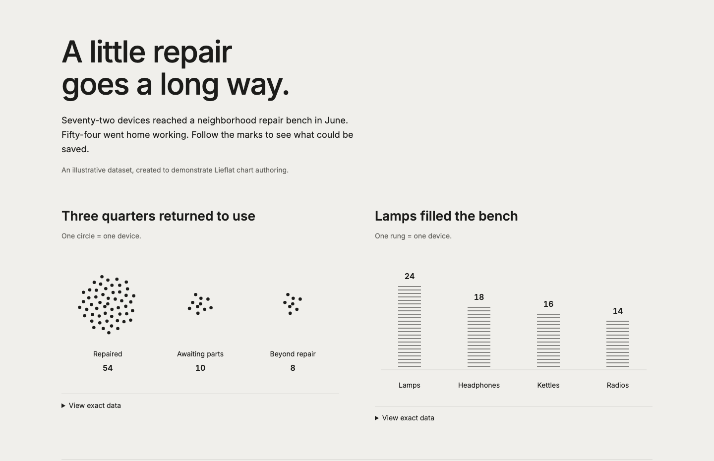

# Artifacture

Readable charts, diagrams, and presentations from editable source.

Artifacture gives a coding agent a visual language, reusable React components, and tools that export and check the result. Use it to explain a system, compare data, review a change, or build a presentation. The output opens as a standalone HTML file; the source remains available for the next revision.



## Start

```bash
npx skills add theclaymethod/artifacture
```

Then ask for the artifact you need:

```text
Explain this repository's request path with a readable architecture diagram.
Tell the story in these repair records with charts that preserve individual devices and outcomes.
Turn this migration plan into a presentation with supporting detail on demand.
Use Algebrica for a mathematical explainer about projection.
```

For local development, use Node 22 or newer:

```bash
npm install
npm run ve:export -- examples/visual-explainer-mdx/data-charts.mdx --out dist/charts.html
```

## Visual language

**Lieflat** is the default for data stories. Countable units make a population tangible; dated marks reveal activity; matrices expose intersections; individual paths follow outcomes. Choose the form for what it explains. Paper gray, charcoal, Inter, and generous spacing support that work. Diagrams keep complete labels, readable type, separated branches, and routes that avoid unrelated nodes.

Two other themes offer different reading experiences:

| Theme | Use it for | Visual language |
|---|---|---|
| `lieflat` | Data stories, comparisons, technical explanations | Record-level detail, meaningful encodings, open editorial layouts |
| `algebrica` | Definitions, proofs, long-form explanations | Warm stone, serif headings, clear mathematical geometry |
| `mono-color` | Posters, covers, editorial presentations | Neutral paper, limited inks, asymmetric composition |

Set `preset` on `ExplainerShell`, `SlideDeck`, `PresentationDeck`, or `PosterCanvas`. Existing named presets remain available for older sources. Algebrica replaces the former standalone Nothing template.

The visual references are [Lieflat Charts](https://github.com/larashero3-dotcom/lieflat-charts), [Algebrica](https://github.com/antoniolupetti/algebrica), and [Mono Color](https://github.com/yanliudesign/mono-color-skill). Artifacture implements its own themes and components; it does not bundle their reference images or noncommercial source code. [Provenance and licenses](tools/visual-sources.json).

[Algebrica preview](docs/img/examples/algebrica.png) · [Mono Color preview](docs/img/examples/mono-color.png) · [Diagram preview](docs/img/examples/diagram.png)

Typography follows [Pierrick Calvez's guidance](https://www.pierrickcalvez.com/journal/a-five-minute-guide-to-better-typography): clear text blocks, deliberate hierarchy, comfortable measures, and careful spacing. The [typography reference](plugins/visual-explainer/references/typography.md) turns those principles into authoring defaults.

## Choose the right tool

| Need | Tool | Editable source |
|---|---|---|
| Units, dated activity, intersections, or individual paths | `LieflatChart` | Chart JSON / MDX / TSX |
| Quick bar, line, or dot comparison | `DataChart` | MDX / TSX |
| Embedded flow, tree, swimlane, or timeline | `DiagramCanvas` | MDX / TSX |
| An animated request or message sequence | `DiagramWalkthrough` | MDX / TSX |
| Architecture, workflow, sequence, data flow, or lifecycle | Archify | Typed JSON |
| A readable deck or horizontal magazine | `SlideDeck` | MDX / TSX |
| A presentation with drill-down details | `PresentationDeck` | TSX |
| Code, diffs, tables, or an interactive explanation | Shared components | MDX / TSX |

`DiagramCanvas` sizes nodes from their content, keeps edge labels separate, and supports horizontal or vertical direction. Dense diagrams scroll locally; supported layouts provide a readable mobile alternative.

`DiagramWalkthrough` follows an authored sequence, one route at a time. Play, pause, or step through the handoffs while the full diagram stays readable. It starts paused, stops at the end, and supports static stepping with reduced motion. The original controller draws on [PR Lens's ordered data-flow diagrams](https://github.com/coldteadotai/pr-lens). [Walkthrough API and example](plugins/visual-explainer/references/animated-diagrams.md).

## Author charts

`LieflatChart` implements five families: `rung-bars`, `unit-field`, `barcode`, `bubble-matrix`, and `threads`. Each has a defined data contract. This is an original, bounded implementation of those forms, not the full upstream catalog.

For a standalone chart, edit [lieflat-chart.json](examples/visual-explainer-mdx/lieflat-chart.json) and export it directly:

```bash
npm run ve:chart -- examples/visual-explainer-mdx/lieflat-chart.json --out dist/chart.html
```

The JSON envelope is `{title, description?, source?, spec}`. The same fields work as component props inside an MDX or TSX page:

```jsx
<LieflatChart
  title="Follow each device from fault to outcome"
  source={{ label: 'Illustrative data' }}
  spec={{
    kind: 'threads',
    unitLabel: 'device',
    stages: ['Fault', 'Action', 'Outcome'],
    records: [
      { id: 'A', path: ['Cable', 'Replace', 'Returned to use'] },
      { id: 'B', path: ['Battery', 'Replace', 'Returned to use'] },
      { id: 'C', path: ['Battery', 'Inspect', 'Awaiting part'] },
    ],
  }}
/>
```

Each thread is one record; each unit mark counts a declared quantity. Barcode positions preserve actual date intervals, and matrix circle areas encode values. Never manufacture records to fill a visual. Use `DataChart` for a quick comparison when a few bars or dots answer the question.

The [chart guide](plugins/visual-explainer/references/charts.md) covers form selection, all five contracts, and complete recipes. The [repair narrative](examples/visual-explainer-mdx/data-charts.mdx) composes several views from one illustrative dataset.

## Archify

Artifacture integrates a pinned [Archify](https://github.com/tt-a1i/archify) release for standalone system diagrams. Setup downloads the runtime once; ordinary rendering does not update it.

```bash
npm run ve:archify -- setup
npm run ve:archify -- guide "API request with cache fallback" --json
npm run ve:archify -- validate architecture examples/visual-explainer-mdx/artifacture.architecture.json --json
npm run ve:archify -- deliver architecture examples/visual-explainer-mdx/artifacture.architecture.json dist/architecture.html --json
```

The wrapper uses showcase quality by default and preserves Archify's diagnostics and atomic delivery. Set `meta.visual_preset` to `editorial` for Artifacture's paper-and-charcoal treatment. Other Archify styles remain available. Keep the JSON beside the exported HTML. `npm run ve:archify -- path` prints the installed runtime directory for schemas and examples.

## Examples

The [example guide](examples/README.md) links editable sources and export commands. Start with:

- [Charts](examples/visual-explainer-mdx/data-charts.mdx)
- [Cache request diagram](examples/visual-explainer-mdx/diagram-canvas.mdx)
- [Animated walkthrough](examples/visual-explainer-mdx/animated-diagram.mdx)
- [Theme comparison](examples/visual-explainer-mdx/preset-gallery.mdx)
- [Archify architecture](examples/visual-explainer-mdx/artifacture.architecture.json)
- [Interactive presentation](examples/visual-explainer-mdx/presentation-deck.tsx)
- [HTML templates](plugins/visual-explainer/templates/README.md)

## Verify and revise

```bash
npm run ve:verify -- dist/charts.html --json dist/charts.report.json --screens dist/charts-screens
npm run check:fast
npm run ve:eval
npm run ve:eval-presentation
```

The verifier checks exported behavior and layout in a real browser. Visual review checks composition, reading order, labels, and fidelity to the brief. An artifact is verified only when both required stages are complete. Edit the source and re-export after feedback; generated HTML is disposable output.

[Visual comparison](docs/visual-review.md) · [Verification workflow](plugins/visual-explainer/references/verification.md) · [Presentation guide](docs/presentation-deck.md) · [Contributing](CONTRIBUTING.md)

## License

MIT. Artifacture began as a fork of [nicobailon/visual-explainer](https://github.com/nicobailon/visual-explainer). External runtimes retain their own licenses and notices.
