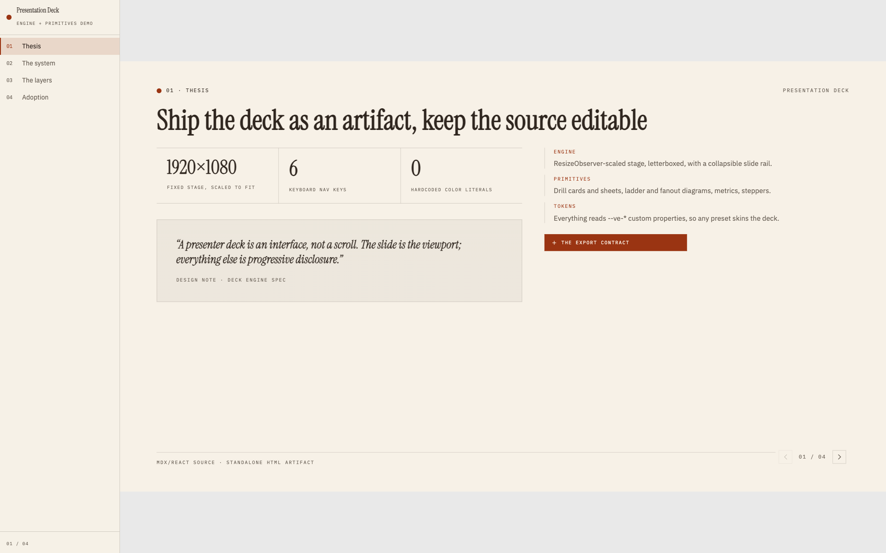
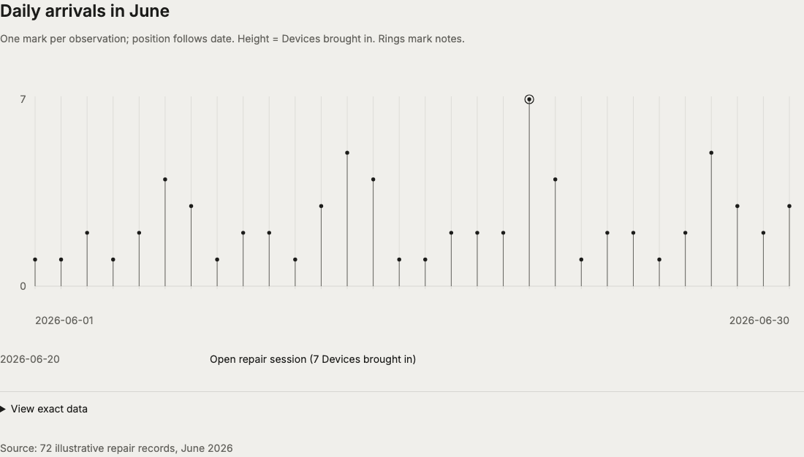
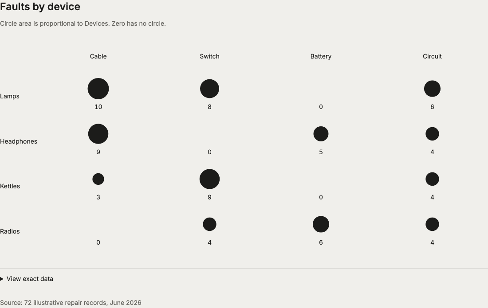
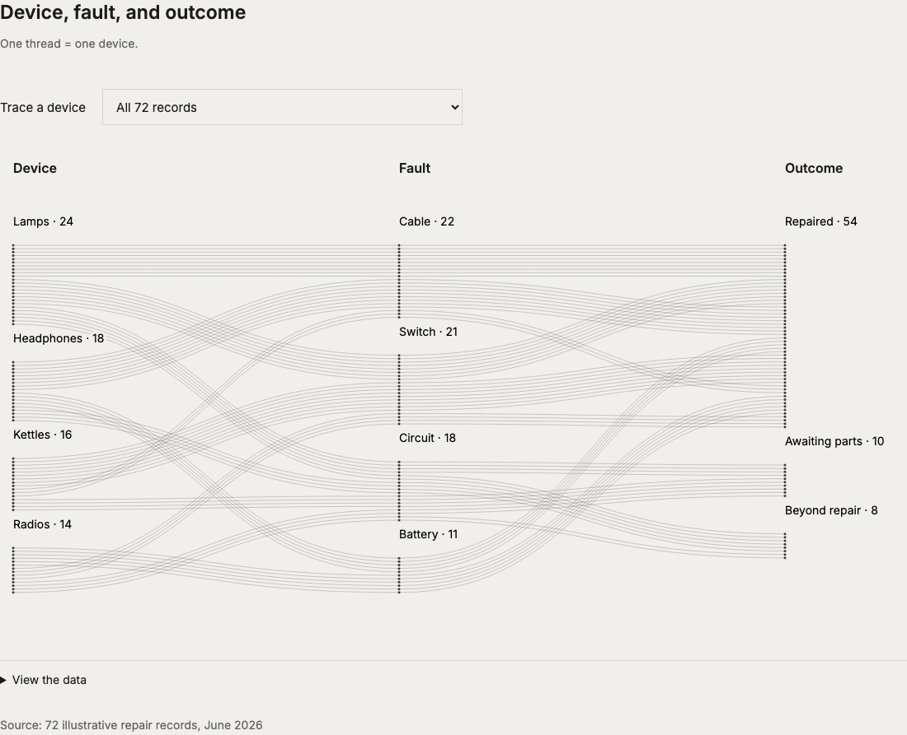
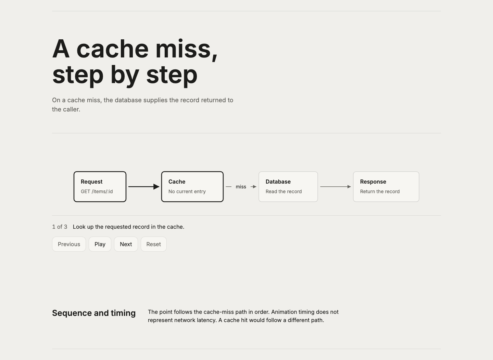
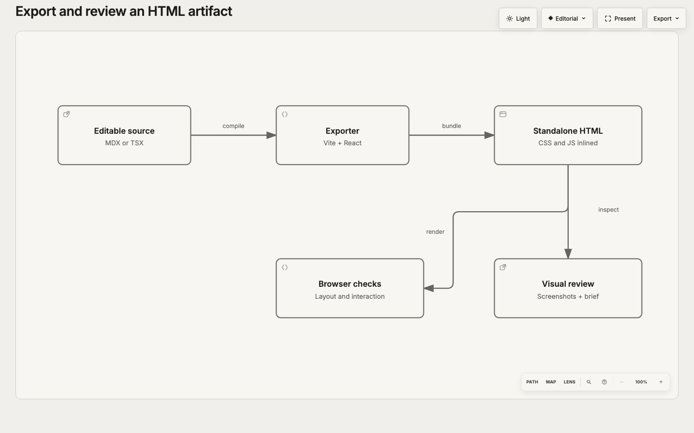
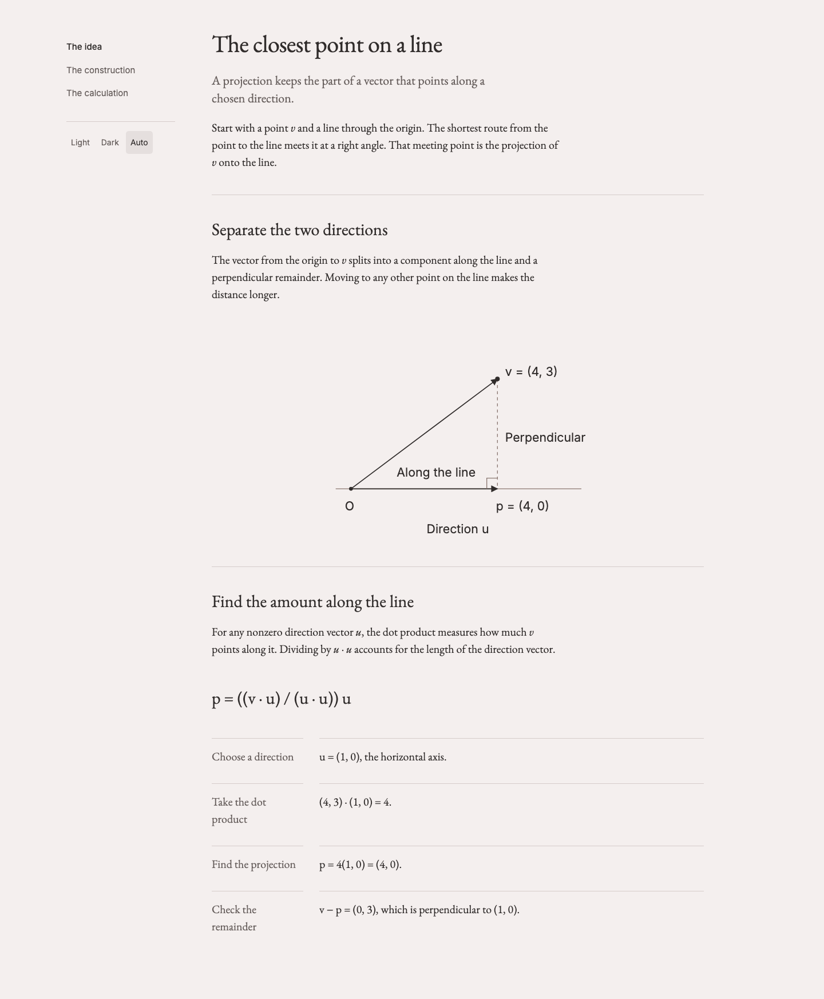

# Artifacture

Multiple visual formats from token-efficient source.

Artifacture gives coding agents a shared library for pages, slide decks, magazines, posters, and interactive explanations. Write the content in MDX, use TSX for custom behavior, or describe a chart in JSON. Components supply the layout, styling, and interaction; exporters produce standalone HTML.

The agent spends tokens on your explanation and data. Repeated HTML, CSS, chart geometry, and presentation controls live in the library.


## One library, several formats

Compose charts, diagrams, code, and text inside the format your reader needs. The same component library serves a reading page, a slide sequence, or a poster; each has its own layout and reading order.

| Reading page | Slide deck |
|---|---|
| [](docs/img/examples/page.png) | [](docs/img/examples/deck.png) |

| Horizontal magazine | Presentation with drill-down details |
|---|---|
| [](docs/img/examples/magazine.png) | [](docs/img/examples/presentation-deck.png) |

| Poster | Interactive explanation |
|---|---|
| [](docs/img/examples/poster.png) | [](docs/img/examples/quiz.png) |

<a id="start"></a>

## Start with your material

```bash
npx skills add theclaymethod/artifacture
```

Ask your coding agent for an artifact:

```text
Make a data story from these repair records, with charts for outcomes and faults.
Explain this repository's request path as a step-by-step diagram.
Turn this migration plan into a slide deck with supporting detail on demand.
```

The skill loads the task-specific guidance it needs. It authors editable source, exports the result, and checks it in a browser.

For local development, use Node 22 or newer and run these commands from the checkout:

```bash
npm install
npm run ve:export -- examples/visual-explainer-mdx/data-charts.mdx --out dist/charts.html
```

## Compact source, complete output

A chart is a title and a data specification:

```json
{
  "title": "Lamps were most common",
  "source": { "label": "Illustrative workshop records" },
  "spec": {
    "kind": "rung-bars",
    "unit": 1,
    "unitLabel": "device",
    "data": [
      { "label": "Lamps", "value": 24 },
      { "label": "Headphones", "value": 18 },
      { "label": "Kettles", "value": 16 },
      { "label": "Radios", "value": 14 }
    ]
  }
}
```

The renderer supplies the marks, labels, responsive layout, and exact-data table. Export the [example JSON](examples/visual-explainer-mdx/lieflat-chart.json):

```bash
npm run ve:chart -- examples/visual-explainer-mdx/lieflat-chart.json --out dist/chart.html
```

MDX combines prose with components such as `LieflatChart`, `DiagramCanvas`, and `DiffBlock`. TSX adds state and custom visuals. Revisions change the source and reuse the rendering code, keeping layout and interaction boilerplate out of the agent’s response.

Token efficiency comes from this division of work and task-specific guidance. Exported HTML includes the runtime it needs; its file size is separate from the source the agent writes.

<a id="choose-the-right-tool"></a>

## Visual tools you can combine

| Show | Tool | Author in |
|---|---|---|
| Counts, dated activity, intersections, individual paths | `LieflatChart` | JSON / MDX / TSX |
| A few values to compare | `DataChart` | MDX / TSX |
| Flows, trees, swimlanes, timelines | `DiagramCanvas` | MDX / TSX |
| A sequence revealed step by step | `DiagramWalkthrough` | MDX / TSX |
| Complex architecture, workflows, data flows, lifecycles | Archify | Typed JSON |
| Code changes, structured data, comparisons, questions | `DiffBlock`, `JsonTree`, `DecisionMatrix`, `Quiz` | MDX / TSX |

<a id="author-charts"></a>

### Data stories

Lieflat is the default chart language. Its five forms—`unit-field`, `rung-bars`, `barcode`, `bubble-matrix`, and `threads`—show counts, comparisons, dates, intersections, and individual paths. All five views in the [repair story](examples/visual-explainer-mdx/data-charts.mdx) use the same 72 explicitly illustrative records.







Use the [chart guide](plugins/visual-explainer/references/charts.md) for data contracts and authoring examples.

### Diagrams and walkthroughs

`DiagramCanvas` sizes nodes from their labels and routes around unrelated nodes. Flow layouts adapt to available width; dense figures scroll locally, and supported layouts provide mobile alternatives.

`DiagramWalkthrough` reveals authored steps along the graph’s routes. Playback starts paused, with manual stepping available on mobile and with reduced motion.



[Walkthrough source](examples/visual-explainer-mdx/animated-diagram.mdx) · [Walkthrough API](plugins/visual-explainer/references/animated-diagrams.md)

<a id="archify"></a>

For larger system maps, Artifacture integrates a pinned Archify runtime with typed schemas and validation.



```bash
npm run ve:archify -- setup
npm run ve:archify -- guide "API request with cache fallback" --json
npm run ve:archify -- validate architecture examples/visual-explainer-mdx/artifacture.architecture.json --json
npm run ve:archify -- deliver architecture examples/visual-explainer-mdx/artifacture.architecture.json dist/architecture.html --json
```

<a id="visual-language"></a>

## Shared visual defaults

Typography, spacing, and colors come from presets shared across formats. Lieflat defaults to paper gray, charcoal, and direct labels. Algebrica adds serif reading text; Mono Color uses restrained color and asymmetric composition.

| Algebrica | Mono Color |
|---|---|
| [](docs/img/examples/algebrica.png) | [](docs/img/examples/mono-color.png) |

Set `preset` on `ExplainerShell`, `SlideDeck`, `PresentationDeck`, or `PosterCanvas`. You can also [supply a design system](docs/design-systems.md).

## Export, check, revise

Keep the MDX, TSX, or JSON as the editable source. Share the exported HTML. Browser checks catch mechanical failures; visual review checks composition, reading order, and labels.

```bash
npm run ve:verify -- dist/charts.html --json dist/charts.report.json --screens dist/charts-screens
```

Both required review stages must pass before an artifact is verified. Make revisions in the source and export again. See [Verification](plugins/visual-explainer/references/verification.md) for the full process.

<a id="examples"></a>

[Editable examples](examples/README.md) · [Templates](plugins/visual-explainer/templates/README.md) · [Presentation guide](docs/presentation-deck.md) · [Contributing](CONTRIBUTING.md)

## Credits and license

MIT. Artifacture began as a fork of [nicobailon/visual-explainer](https://github.com/nicobailon/visual-explainer).

Visual references include [Lieflat Charts](https://github.com/larashero3-dotcom/lieflat-charts), [Algebrica](https://github.com/antoniolupetti/algebrica), [Mono Color](https://github.com/yanliudesign/mono-color-skill), [PR Lens](https://github.com/coldteadotai/pr-lens), and [Pierrick Calvez’s typography guide](https://www.pierrickcalvez.com/journal/a-five-minute-guide-to-better-typography). [Archify](https://github.com/tt-a1i/archify) is an integrated external runtime. Reference images and noncommercial source implementations are not bundled. See [provenance and licenses](tools/visual-sources.json).
