<p>
  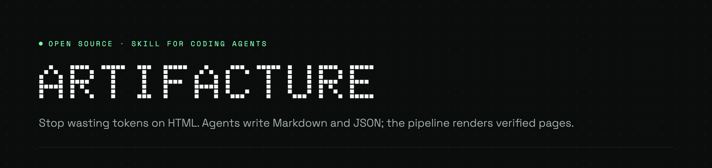
</p>

# Artifacture

**Verified visual explainers for coding agents.** Artifacture turns MDX/React sources into self-contained HTML artifacts: architecture diagrams, code walkthroughs, literate diff explainers, comparison tables, and slide decks. Verification is a routed family of skills: Artifacture runs deterministic mechanics and artifact-specific checks, Impeccable owns general visual craft, and Unslop owns prose. Visual judgment is dispatched to the smallest model and batch size that clears the relevant eval suite; the main agent orchestrates and summarizes instead of spending a frontier-model turn inspecting every screenshot.

Artifacture began as a fork of [nicobailon/visual-explainer](https://github.com/nicobailon/visual-explainer) and preserves its spirit; see Credits below.

[](LICENSE)

Ask your agent to explain a system architecture, review a diff, or compare requirements against a plan. Instead of ASCII art and box-drawing tables, it authors MDX/React source, generates a self-contained HTML artifact, and opens it in your browser.

```
> draw a diagram of our authentication flow
> /visual-explainer:diff-review
> /visual-explainer:plan-review ~/docs/refactor-plan.md
> generate this in Blueprint style
```

<p align="center">
  <video src="demos/videos/longform-16x9.mp4" controls muted playsinline width="820"></video>
  <br>
  <em>Long-form explainer generated via <code>/generate-video --style=long-form</code>. Local render — no cloud, no API keys.</em>
</p>

<p align="center">
  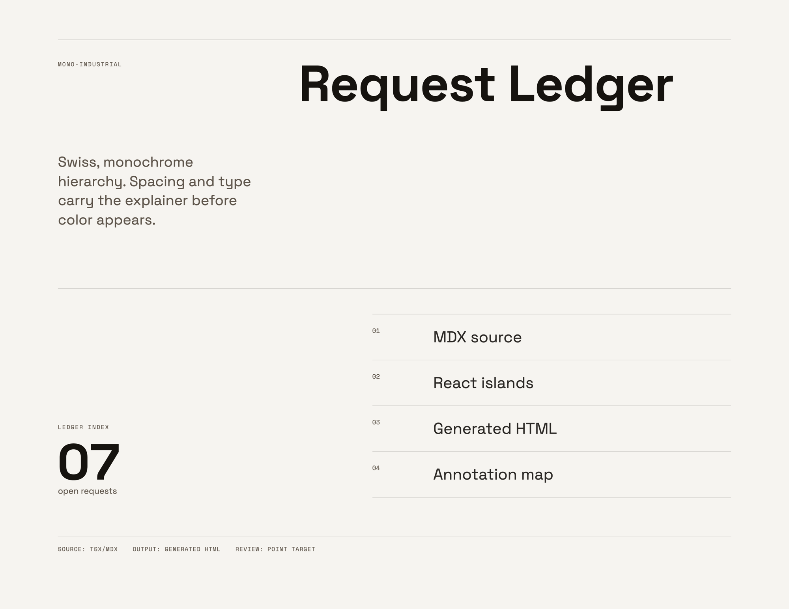
  <br>
  <em>Mono-Industrial — the default aesthetic. Space Grotesk display, Space Mono labels, optional Geist Pixel Square for one moment of surprise per page. Grayscale canvas, status colors only on values.</em>
</p>

<p align="center">
  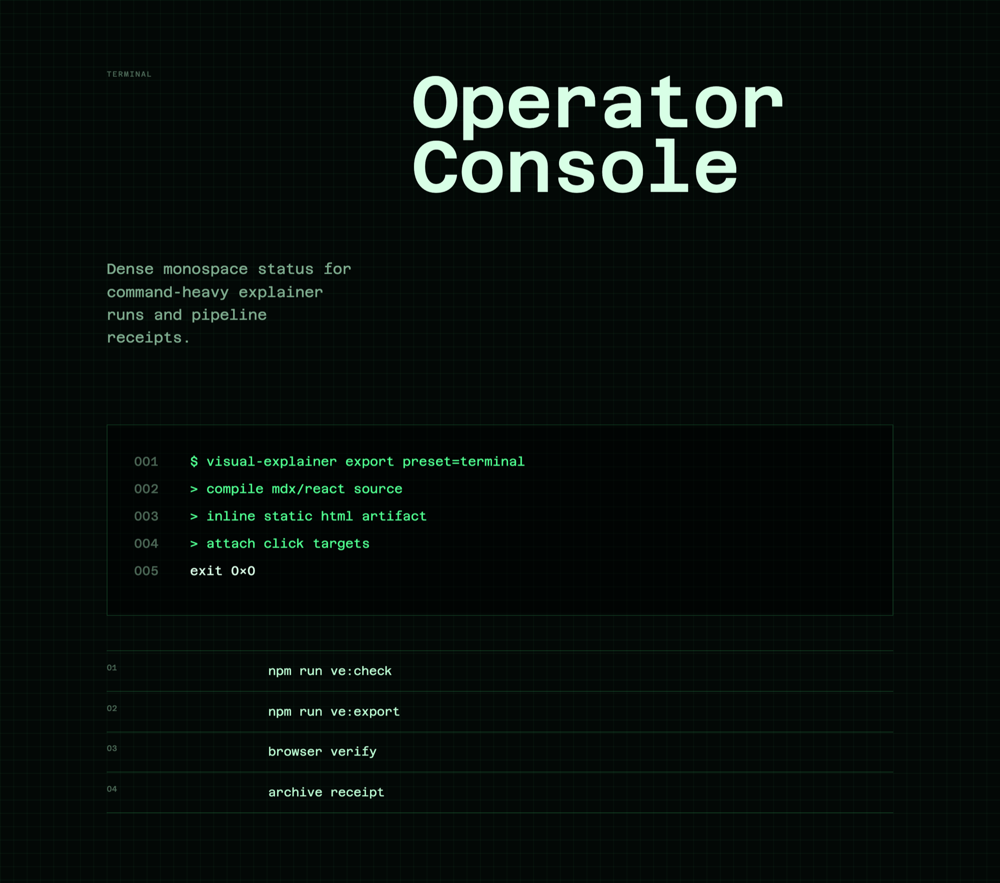
  <br>
  <em>The same MDX source under the Terminal preset — one of six locked aesthetics. Swap the preset, keep the content: the design system changes, the source never does.</em>
</p>

## Examples

Real output, deployed. Every link is an unedited artifact from the pipeline: one self-contained HTML file, view-source friendly. The full set lives at [claytonkim.com/artifacture-examples](https://claytonkim.com/artifacture-examples/index.html).

| | |
|---|---|
| [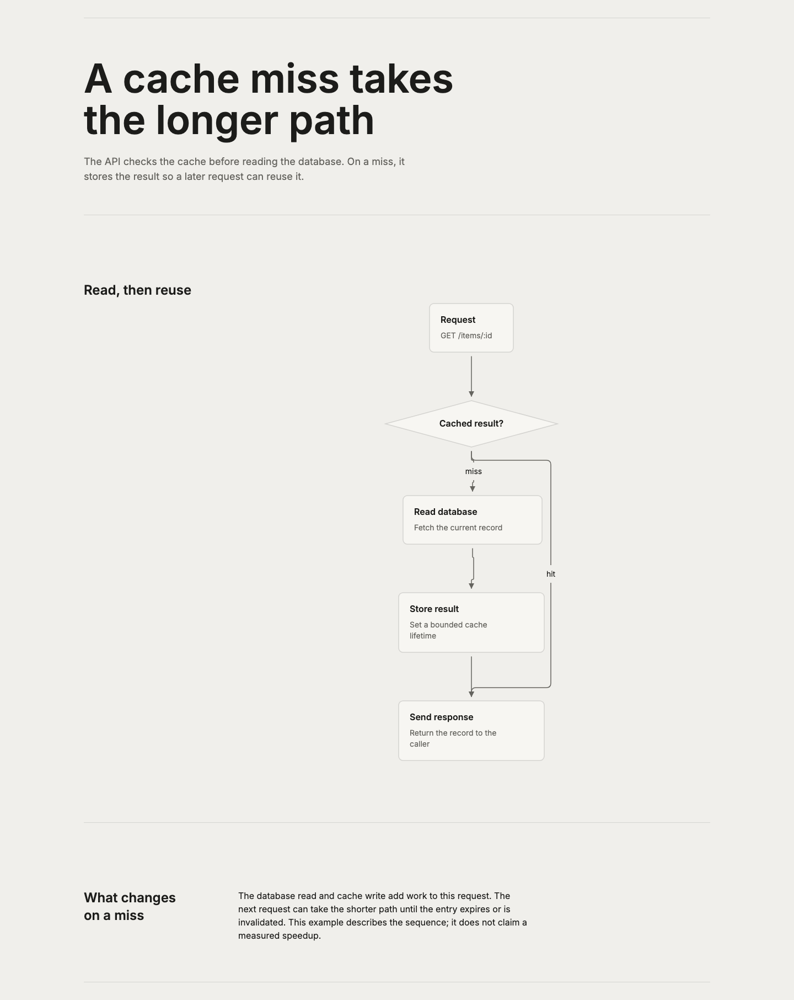](https://claytonkim.com/artifacture-examples/architecture-canvas.html) <br> [**Architecture diagram**](https://claytonkim.com/artifacture-examples/architecture-canvas.html) · computed layout, linearizes on mobile | [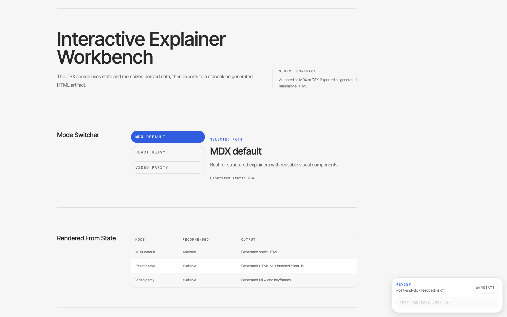](https://claytonkim.com/artifacture-examples/literate-diff.html) <br> [**Literate diff + quiz**](https://claytonkim.com/artifacture-examples/literate-diff.html) · background, walkthrough, comprehension check |
| [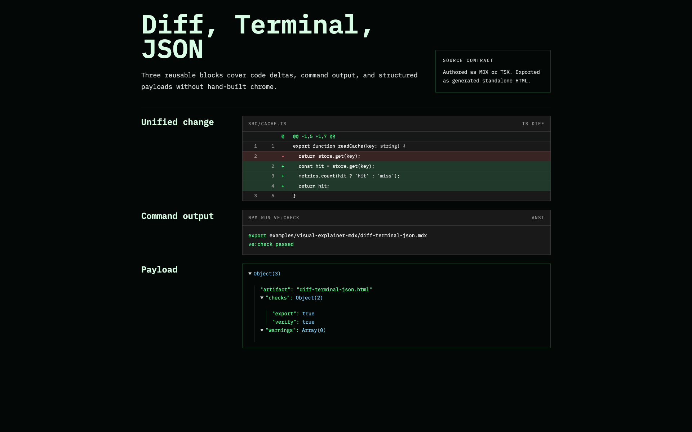](https://claytonkim.com/artifacture-examples/code-blocks.html) <br> [**Diff / terminal / JSON blocks**](https://claytonkim.com/artifacture-examples/code-blocks.html) · build-time Shiki, ANSI, collapsible trees | [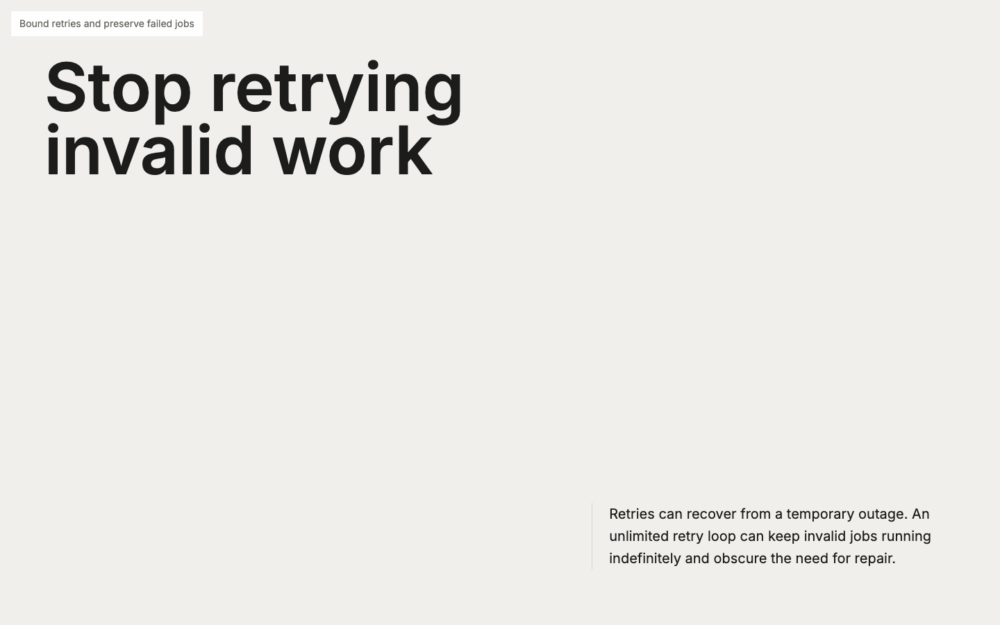](https://claytonkim.com/artifacture-examples/slide-deck.html) <br> [**Slide deck**](https://claytonkim.com/artifacture-examples/slide-deck.html) · scroll-snap, keyboard nav, PDF export |
| [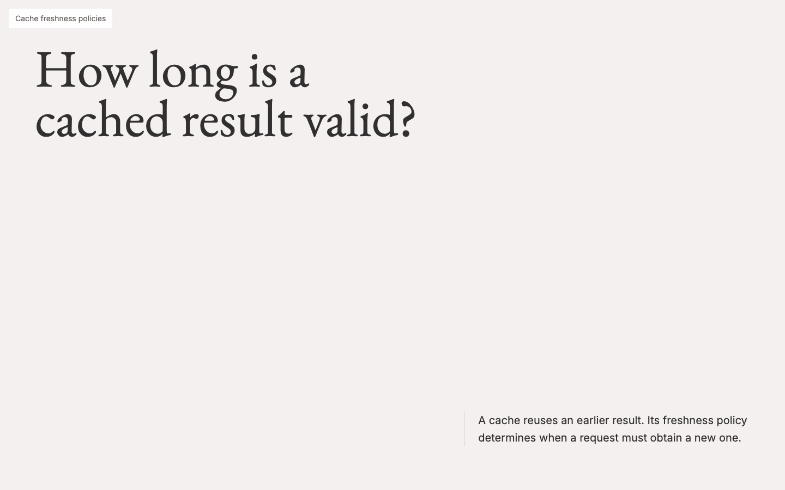](https://claytonkim.com/artifacture-examples/magazine.html) <br> [**Magazine**](https://claytonkim.com/artifacture-examples/magazine.html) · horizontal full-bleed spreads | [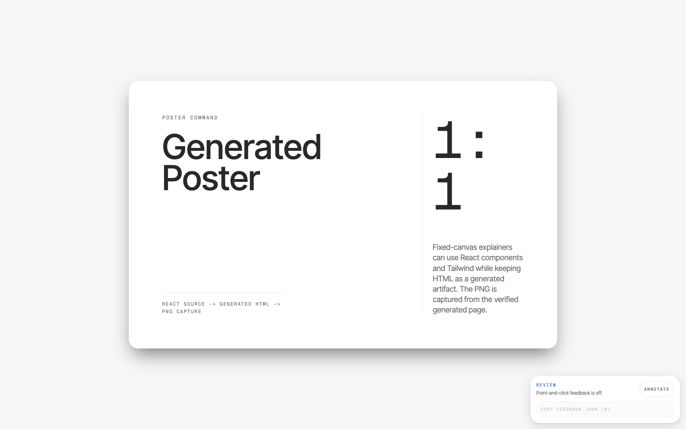](https://claytonkim.com/artifacture-examples/poster.html) <br> [**Poster**](https://claytonkim.com/artifacture-examples/poster.html) · fixed canvas, PNG export |
| [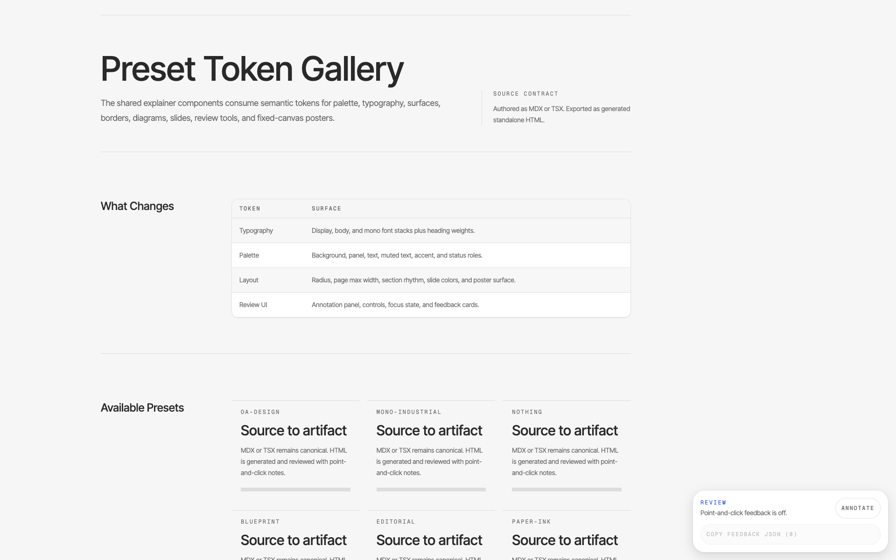](https://claytonkim.com/artifacture-examples/preset-gallery.html) <br> [**Six presets**](https://claytonkim.com/artifacture-examples/preset-gallery.html) · one source, six locked aesthetics | [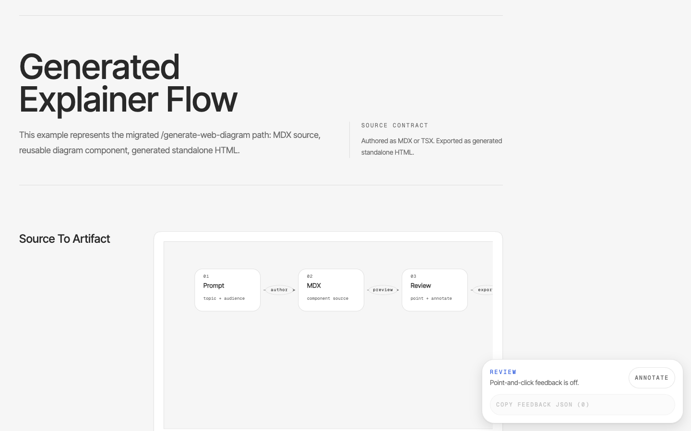](https://claytonkim.com/artifacture-examples/architecture-diagram.html) <br> [**Explainer page**](https://claytonkim.com/artifacture-examples/architecture-diagram.html) · the default scrollable format |

Video formats (9:16 reel, 16:9 long-form) render to MP4 through Hyperframes; sample clips are in [docs/features.md](docs/features.md#4-video-output-via-hyperframes--explainer-mp4s-not-just-html).

## What it adds to upstream visual-explainer

- **ve-verify** (`scripts/verify/`): 152 executable mechanics checks plus one grounded, profile-aware artifact review. Static scans and real-browser measurements catch shipping failures; the finalizer binds review verdicts to the artifact, truth brief, rendered inventory, and screenshot evidence.
- **Tiered agent docs**: SKILL.md plus one covered-flow card now reads about 1,400–1,600 tokens instead of 62,000. A checked-in 3,000-token budget prevents the default path from regressing; deep references load only when their branch is selected.
- **Shared component system** (`visual-explainer-mdx/components.tsx`): DiagramCanvas with computed layout and CSS-only mobile linearization, build-time Shiki CodeBlock, DiffBlock, TerminalBlock, JsonTree, an interactive Quiz, MermaidBlock with zoom/pan chrome, decks, posters, and more. Strict-export integrity checks catch bad edge ids and undefined components at build time.
- **PresentationDeck** (`visual-explainer-mdx/presentation.tsx`): a second deck engine for presented (not scrolled) decks — a fixed 1920×1080 stage scaled to fit any screen, collapsible slide rail, two-axis keyboard navigation (Left/Right for slides; Up/Down for ordered click-ins or custom states, falling through to the next slide when exhausted), and drill-down primitives (click-to-expand cards/sheets with a click-anywhere-to-close guard, ladder/fanout diagrams, metrics, steppers). Fully `--ve-*` token-driven so every preset skins it; its behavioral contract is pinned by a headless eval suite (`npm run ve:eval-presentation`). See [docs/presentation-deck.md](docs/presentation-deck.md) for when to use it vs `SlideDeck`.
- **`/explain-diff`**: a literate diff mode (background → intuition → walkthrough → quiz), adapted from Geoffrey Litt's prompt pattern.
- **Product and model evals with separate jobs**: a six-case, human-reviewed product benchmark governs artifact quality. `evals/model-matrix/` generates evidence; `evals/visual-model-policy/` is resumable, budgeted model-routing research. Detector consistency is not treated as product improvement.
- **One-command team sharing**: `share.sh` deploys to Vercel (zero setup, public) or sharehtml on Cloudflare (stable update-in-place URLs, team SSO via Cloudflare Access, comments). See `docs/TEAM-SHARING.md`.
- **External design systems + `ve:learn`**: brand token sets are user-owned artifacts resolved from a registry outside the skill (`$ARTIFACTURE_DESIGN_DIR` → `~/.artifacture/design-systems/` → repo `design-systems/`) and inlined into exports by preset name. `npm run ve:learn -- <code-file|url|image> --name <slug>` drafts a system from a token source, a live page, or an image palette; deterministic heuristics are pinned by their own eval suite (`evals/design-systems/`). The repo ships the mechanism only — systems (typically private brand tokens) live in your own registry. See `docs/design-systems.md`.

## Skill family

Artifacture is the artifact-mechanics and evidence-routing member of a skill
family:

| Skill | Owns |
|---|---|
| **Artifacture** | export mechanics, browser/state evidence, and one profile-aware artifact review |
| **Impeccable** | general visual craft, design specificity, typography, color, generic decoration, and visual AI tells |
| **Unslop** | prose cadence, voice, and AI-writing patterns |

Artifacture does not copy the other skills' judgment prompts or detector
taxonomies. Impeccable and Unslop are explicit opt-ins. Artifacture-owned visual
judgment uses an exact profile-qualified route when one exists. The current
small paid template measures narrower prerequisite routes and does not qualify
the composite review. Until dedicated evidence exists, Artifacture uses the
best available visual-capable model and labels it an unqualified fallback.

See [installation and family setup](docs/installation.md) and the
[visual-model policy harness](evals/visual-model-policy/README.md).

## Install

Any agent with skills support (Claude Code, Codex, Cursor, and others), via the [skills CLI](https://skills.sh):

```bash
npx skills add theclaymethod/artifacture
```

Install the recommended companion skills:

```bash
npx impeccable skills install
npx skills add theclaymethod/unslop
```

When the render pipeline is not already installed, setup clones it to
`~/.artifacture` (one-time, Node >= 22); full-clone installs use the repo in place. The companion skills
remain independently versioned and keep ownership of their prompts.

**Claude Code, as a plugin:**

```bash
git clone https://github.com/theclaymethod/artifacture.git
/plugin marketplace add ./artifacture
```

**Manual, for any harness that reads file-based skills:**

```bash
git clone --depth 1 https://github.com/theclaymethod/artifacture.git /tmp/artifacture
cp -r /tmp/artifacture/plugins/visual-explainer ~/.agents/skills/visual-explainer
rm -rf /tmp/artifacture
```

After installation, follow [docs/installation.md](docs/installation.md) to
verify the render pipeline, detect missing companion skills, and install or
generate a visual-model policy. Until a pass has an eval-qualified route,
Artifacture records `no-eval-qualified-model`, runs the best available
visual-capable model, and marks the execution `unqualified-fallback`.

For the upstream project, see [nicobailon/visual-explainer](https://github.com/nicobailon/visual-explainer).

## Commands

| Command | What it does |
|---------|-------------|
| `/generate-web-diagram` | Generate an HTML diagram for any topic (inline SVG by default, Mermaid fallback) |
| `/generate-visual-plan` | Generate a visual implementation plan for a feature or extension |
| `/generate-slides` | Generate a magazine-quality slide deck (vertical, or `--magazine` for horizontal editorial layout) |
| `/generate-poster` | Generate a single-canvas poster via poster-ai |
| `/generate-video` | Generate an explainer MP4 via Hyperframes (`--style=long-form` or `--style=reel`) |
| `/render-video` | Convert an existing HTML deck or magazine to an MP4 |
| `/diff-review` | Visual diff review with architecture comparison and code review |
| `/plan-review` | Compare a plan against the codebase with risk assessment |
| `/project-recap` | Mental model snapshot for context-switching back to a project |
| `/fact-check` | Verify accuracy of a document against actual code |
| `/annotate` | Open an artifact in the click-to-comment and direct-text-edit developer preview |
| `/share` | Share an HTML page via sharehtml team access or Vercel fallback |

The agent also kicks in automatically when it's about to dump a complex table in the terminal (4+ rows or 3+ columns) — it renders HTML instead.

## Developer preview

Run `node plugins/visual-explainer/scripts/preview.mjs <artifact.html>` or use
`/annotate`. The agent starts the server and opens the served URL directly. The
preview supports exact-element comments, compact source-aware notes for coding
agents, and guarded direct text edits that write the owning MDX/TSX source,
rebuild, and preserve the current slide. npm, pnpm, and Bun are all supported;
Bun is optional. Preview chrome, pins, and review state never enter the
published HTML.

For private team sharing setup, see [`docs/TEAM-SHARING.md`](docs/TEAM-SHARING.md).

## Docs

- [Features](docs/features.md): the full capability reference, including all output modes, aesthetics, and how generation works.
- [Installation and skill family](docs/installation.md): core setup, companion skills, failure behavior, and visual-model policy.
- [Design systems](docs/design-systems.md): the external design-system registry format, resolution order, `ve:learn` token learning, and the agent-assisted refinement flow.
- [PresentationDeck vs SlideDeck](docs/presentation-deck.md): which deck engine to reach for, the drill-down primitives, and the eval-pinned behavioral contract.
- [Team sharing](docs/TEAM-SHARING.md): one-command deploys to Vercel or a team-gated Cloudflare space.
- [Skill docs](plugins/visual-explainer/SKILL.md): what an agent actually reads, plus the per-use-case [cards](plugins/visual-explainer/cards/).
- [Verifier](plugins/visual-explainer/scripts/verify/): the deterministic design-quality gate and its [eval suite](evals/).
- [Model-matrix harness](evals/model-matrix/): benchmark your own model or agent on the same briefs.
- [Product benchmark](evals/product-benchmark/): blind human pairwise review of six representative artifacts.
- [Visual-model policy harness](evals/visual-model-policy/): resumable, budgeted qualification research; narrow routes do not qualify composite reviews.

## Limitations

- Requires a browser to view HTML output
- Results vary by model capability
- Demo capture requires `ffmpeg` (always) plus either Playwright MCP or `agent-browser` (either one works)
- Video output (`/generate-video`, `/render-video`) requires Node ≥ 22 and FFmpeg; the skill runs `hyperframes-doctor.sh` at the start of any video command and aborts with install hints if prerequisites are missing

## Credits

Artifacture is derived from [nicobailon/visual-explainer](https://github.com/nicobailon/visual-explainer) (MIT) by Nico Bailon — the original skill concept, aesthetic system, and template library. Borrows ideas from [Anthropic's frontend-design skill](https://github.com/anthropics/skills) and [interface-design](https://github.com/Dammyjay93/interface-design).

The `/explain-diff` literate diff mode adapts [Geoffrey Litt's explain-diff prompt](https://gist.github.com/geoffreylitt/a29df1b5f9865506e8952488eac3d524). The Nothing aesthetic adapts [dominikmartn/nothing-design-skill](https://github.com/dominikmartn/nothing-design-skill). Team sharing integrates [jonesphillip/sharehtml](https://github.com/jonesphillip/sharehtml) as an optional backend. The component-contract and token-economics approach was informed by measuring [modem-dev/sideshow](https://github.com/modem-dev/sideshow)'s surface model. SVG text measurement guidance references [chenglou/pretext](https://github.com/chenglou/pretext).

Diagram routing and SVG guidance adapt [cathrynlavery/diagram-design at `a5e3978`](https://github.com/cathrynlavery/diagram-design/tree/a5e3978088cf89c7caff5c20cabd99fbc2a301de) (MIT; copyright 2025 Cathryn Lavery).

Video output wraps [HeyGen's Hyperframes](https://github.com/heygen-com/hyperframes) (Apache 2.0) — local HTML → MP4 rendering via headless Chrome + GSAP + FFmpeg.

## License

MIT
