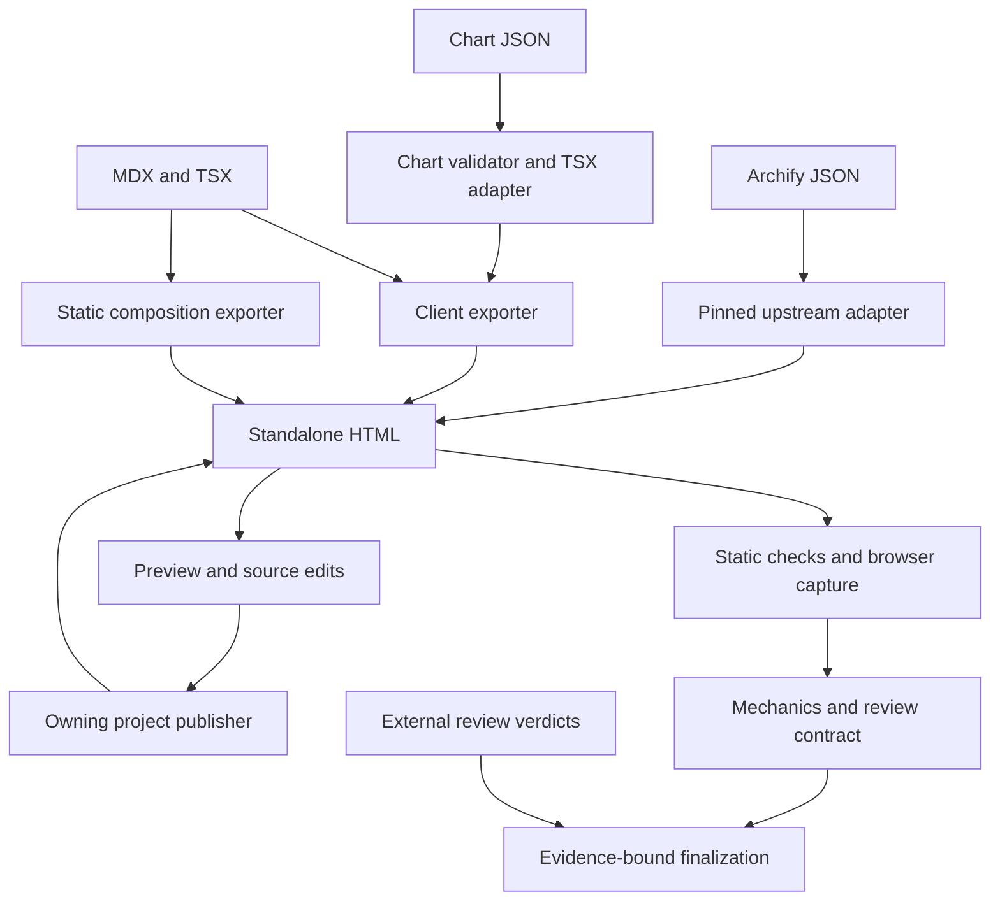

# Agent-friendly architecture for Artifacture

Give each shared rule one domain owner, and give each build, capture, and edit attempt its own files and revision identity. Keep the supported source formats, commands, and physical component import. Select focused modules as the base architecture; borrow immutable capture receipts and staged publication from the workspace alternative. A permanent workspace coordinator is unnecessary for ordinary component use.

Authors retain editable MDX, TSX, chart JSON, Archify JSON, and standalone HTML. Maintainers gain complete-operation APIs, enforced dependency boundaries, and one authoring location for repeated contracts. Agents can change a rule locally through supported owners. Cooperating writers publish under an operation lease and an expected revision instead of silently replacing another attempt.

The user approved this architecture and selected Full Autopilot on October 4, 2026: "Otherwise go full autopilot on the fixes." Execution is active. Each PR has an owner; the coordinator aggregates independent reviews, and the owner merges only after a clean verdict for the matching patch and green current-head CI. New test files, helpers, fixtures, paid runs, and deployments remain outside that grant.

Phase 1 merged in [PR 14](https://github.com/theclaymethod/artifacture/pull/14) at `9e0f908b681ebbaabd8a963453e0d982115f2dd6`. Its final patch passed all six independent review lanes; the owner synchronized all 13 changed paths into the original checkout and completed the post-merge review sweep. Phase 2 is active in [PR 16](https://github.com/theclaymethod/artifacture/pull/16) with a fresh browser-capture owner; phases 3 through 7 have not started implementation. The parent’s graphics, theme, video, and collection foundation merged in [PR 15](https://github.com/theclaymethod/artifacture/pull/15) at `a54787b6f1366305bf1c88a0559071e6037aa13a`. Overlapping phases must preserve its interfaces and verify the combined tree. The [execution queue](/Users/claytonkim/.codex/investigations/artifacture-architecture-2026-10-03/execution/program.md), [owner records](/Users/claytonkim/.codex/investigations/artifacture-architecture-2026-10-03/execution/owners.tsv), and per-round verdicts hold subsequent status. Preserve the dirty original checkout, user files, and parent-owned paths; synchronize only unchanged owned destinations or provide candidate patches for collisions.

## Historical architecture and baseline

The initial investigation targeted committed HEAD `2f3664b4f1b8afb6f6e83230edecaa7820a9f11d` on `codex/oa-design-anti-slop-cleanup`. Executable experiments ran in archives outside the shared checkout, using existing dependencies. Other work appeared during that planning run and was preserved; this document was its only intended repository addition. The following measurements describe that historical baseline, not the later implementation or foundation.



The [architecture trace](/Users/claytonkim/.codex/investigations/artifacture-architecture-2026-10-03/grounding/architecture-synthesis.md), [source map](/Users/claytonkim/.codex/investigations/artifacture-architecture-2026-10-03/grounding/source-map.md), and [verification map](/Users/claytonkim/.codex/investigations/artifacture-architecture-2026-10-03/grounding/verification-map.md) trace actual public commands and ownership.

- [components.tsx](/Users/claytonkim/dev/artifacture/visual-explainer-mdx/components.tsx:1) is the documented physical API and contains implementation as well as re-exports. The package has no export map. Its walkthrough re-export imports the facade back, creating the scoped graph's only cycle.
- [export.mjs](/Users/claytonkim/dev/artifacture/scripts/ve-mdx/export.mjs:73) compiles a hydration bundle, injects design-system CSS, and writes HTML directly. [export-static.mjs](/Users/claytonkim/dev/artifacture/scripts/ve-mdx/export-static.mjs:30) renders a source-owned complete document for video. These are distinct supported contracts. Chart export already stages its final output before rename.
- [design-systems.mjs](/Users/claytonkim/dev/artifacture/scripts/ve-mdx/design-systems.mjs:118) resolves environment, home, then repository registries. Private brands stay outside the skill tree. Malformed higher-priority entries fail closed; built-ins cannot be shadowed. Learning currently writes CSS and manifest sequentially.
- Verification owns a mutable context. Mechanics success means zero reported errors; it does not mean visual review completed. Finalization binds selected files and external verdicts, but trusts summary arithmetic and omits screenshots referenced within deck manifests.
- Browser launch, readiness, profile inference, and serving recur in verifier, PDF, development, and eval paths. The shared exact-origin network policy is already a useful owner. Remote CSS fetching has separate redirect and address constraints.
- Preview has an instance-local queue, heuristic source matching, direct edits, publisher execution, and snapshot rollback. Other preview processes, editors, and publishers do not participate in that queue.
- Skill-only installations copy the plugin scripts and bootstrap a separate runtime clone. A new verifier dependency outside that distributable tree would break the supported installation.

The scoped TypeScript import graph covers 62 executable files, 249 import declarations, and 72 resolved local edges. It excludes tests, fixtures, MDX, and nonliteral dynamic imports. The tracked repository has 514 files, including 17 runtime files and 188 HTML files with mixed fixture, demo, template, and output roles. Two runtime files contain 3,258 of 4,776 TypeScript/TSX lines. These counts locate concentrated ownership; they do not establish defect rates or justify splitting every large file.

The [baseline receipt and logs](/Users/claytonkim/.codex/investigations/artifacture-architecture-2026-10-03/baseline/receipt.md) record these existing commands from an isolated HEAD archive.

```sh
npm run check:fast
npm run lint
npm run ve:eval
npm run ve:eval-presentation
```

All passed. Coverage includes 182 Node tests, typecheck, manifests, 17 client exports with source SSR probes, a static-video export, 153 seeded violations, seven clean fixtures, nine design-system cases, and 25 presentation cases. The export smoke check does not hydrate all emitted bundles in Chromium. The seeded suite uses mechanics-only capture and does not establish full deck review. `ve:eval-product` separately returned `pending-human-review`, with 29 missing comparisons across six cases. It is not a product-quality pass.

No comparative performance measurement or speedup is claimed. Duplicate quadratic diff implementations are a maintenance observation, not a measured bottleneck. The local 120-second aggregate check budget is checked after subprocesses finish; CI does not run that wrapper. Declared paid-eval limits are not enforced by the request runner. Paid providers were not invoked.

## Repeated corrections and their prevention

The [history census](/Users/claytonkim/.codex/investigations/artifacture-architecture-2026-10-03/history/history-report.md) includes all 77 HEAD-reachable non-merge commits with committer timestamps from July 1, 2026, Pacific time onward. Their actual dates span July 4 through September 7. Investigators read corrective or ownership hunks from 34 diffs, archived all patches, and reproduced the archive. One duplicate patch leaves 76 unique stable patches. Eight merges are excluded.

Seventeen distinct corrective commits are counted once each under a primary class. Each class contains at least two distinct corrections. These are conservative lower bounds of recorded corrections, not production incident rates or agent mistake rates. Ties are ordered by the risk visible in the patches. All introduction authorship is unknown. Coauthor/session trailers on corrections do not establish who introduced a defect.

| Rank and class | Count | Concrete corrections and current anchor | Root cause and architectural prevention |
| --- | --- | --- | --- |
| 1. External input escapes its boundary | 4 | [ed4f5c44](https://github.com/theclaymethod/artifacture/commit/ed4f5c444f491ce1eaef439f884644a54d77f003), [72c0fe4d](https://github.com/theclaymethod/artifacture/commit/72c0fe4dcca6d2d2e37ef9208397d149a9b59653), [8e13261e](https://github.com/theclaymethod/artifacture/commit/8e13261e9e9f6918bc9e1f5e3bdf798ce2be2d14), [e9a73f57](https://github.com/theclaymethod/artifacture/commit/e9a73f57b3ddc30c2c8af529a570b4b3a9731742). [Literal parser](/Users/claytonkim/dev/artifacture/scripts/ve-mdx/integrity.mjs:368), [request policy](/Users/claytonkim/dev/artifacture/plugins/visual-explainer/scripts/network-policy.mjs:17). | Expression execution, unsafe CSS interpolation, prefix origins, and unchecked redirects cross trust boundaries. Parse at the literal/token/URL owners and share their policies. Source compilation still executes trusted authored code; literal parsing is not a TSX sandbox. |
| 2. Maintained contract copies disagree | 4 | [3e6151ec](https://github.com/theclaymethod/artifacture/commit/3e6151ec06a73b56849c1e0376580d4b82793956), [581f385d](https://github.com/theclaymethod/artifacture/commit/581f385daa3b0c41b9127408bead7026310bf1dc), [d6501c89](https://github.com/theclaymethod/artifacture/commit/d6501c89cb1a0ff6c3db17ec7a5b3bbc15edbada), [558a887b](https://github.com/theclaymethod/artifacture/commit/558a887bd6bc55a6639368f03b7256d4346a5072). [Manifest checker](/Users/claytonkim/dev/artifacture/scripts/check-manifests.mjs:32), [catalog](/Users/claytonkim/dev/artifacture/plugins/visual-explainer/scripts/verify/checks.json:1666). | Versions, attribution, applicability, and prose have separate authors. Derive release copies and check metadata from canonical owners. Derive the public roster with the TypeScript parser without importing TSX into plain Node. |
| 3. Verification inspects a proxy for behavior | 3 | [de3c8c54](https://github.com/theclaymethod/artifacture/commit/de3c8c54449de362538b3c14682397da887c3bbe), [2ce6b8c5](https://github.com/theclaymethod/artifacture/commit/2ce6b8c5ba4c7b901ed9431b646e5cf8e8445a48), [408ac838](https://github.com/theclaymethod/artifacture/commit/408ac838c074042e84c12d1080b034cf19809f16). [Content probe](/Users/claytonkim/dev/artifacture/scripts/ve-mdx/check.mjs:93), [profile](/Users/claytonkim/dev/artifacture/plugins/visual-explainer/scripts/verify/lib/profile.mjs:65). | Build markers, bundled functions, and unused CSS stand in for authored meaning. Use explicit component markers, hydrated output, and full capture. Keep fallback heuristics at the external-HTML boundary. |
| 4. Components assume one preset or tone | 3 | [14883cf0](https://github.com/theclaymethod/artifacture/commit/14883cf051acc1e5df4b0dfb244262d9debfc05d), [90a15432](https://github.com/theclaymethod/artifacture/commit/90a15432a3d299ecb6e79c1ec7ca9e2d4477f8c8), [591877f0](https://github.com/theclaymethod/artifacture/commit/591877f03ca921083205f5eaa5e1c6cbe8ebfe99). [Tone roles](/Users/claytonkim/dev/artifacture/visual-explainer-mdx/global.css:585), [Metric](/Users/claytonkim/dev/artifacture/visual-explainer-mdx/presentation.tsx:798). | Component-local raw tokens and sizing assume one visual context. Let presentation own semantic tone roles and retain rendered cross-preset acceptance. Preserve the open external preset name type. |
| 5. Commands assume local installation context | 3 | [cda3a0a2](https://github.com/theclaymethod/artifacture/commit/cda3a0a2bee90d7ad0245c4eee2bddca400a8c25), [e2182124](https://github.com/theclaymethod/artifacture/commit/e2182124e28ccd9763aff54156988252772ffdb2), [af0e0dda](https://github.com/theclaymethod/artifacture/commit/af0e0dda8e3d8d4af8059da8df6eb3592a840d16). [Runtime route](/Users/claytonkim/dev/artifacture/plugins/visual-explainer/SKILL.md:17), [React resolution](/Users/claytonkim/dev/artifacture/scripts/ve-mdx/export.mjs:99). | Runtime roots, Chromium paths, and React identity depend on ambient checkout context. Resolve explicit build/browser context once at command boundaries and preserve installed-plugin packaging. |

The [incident ledger](/Users/claytonkim/.codex/investigations/artifacture-architecture-2026-10-03/history/incident-ledger.json) retains full SHAs, inspected scope, confidence, attribution, and exclusions. No product revert was found. One documented Mermaid cross-branch integration break shows branch-local greens missed the combined CDN contract; one case does not establish a recurring race class. A presentation/registry overlap was successfully integrated and is not counted as a shipped defect.

Historical rationale constrains the design. [PR 3](https://github.com/theclaymethod/artifacture/pull/3) keeps private brands external. [PR 2](https://github.com/theclaymethod/artifacture/pull/2) preserves scrolling decks, a new fixed-stage engine, the facade, and open preset names. [PR 10](https://github.com/theclaymethod/artifacture/pull/10) removes duplicated companion-skill judgment and prioritizes representative artifact review. [PR 11](https://github.com/theclaymethod/artifacture/pull/11) makes MDX/TSX the owning source for edits. Preserve these decisions instead of using refactoring to narrow the product silently.

## Designs considered

Both candidates used inherited-parent models, independent briefs, disjoint scratch ownership, runnable sketches, and all eight architect red flags. This is independent same-model review, without multi-model assurance.

| Criterion | Focused domain modules | Persistent artifact workspace |
| --- | --- | --- |
| Caller operation | `buildDocument(context, request)`, `inspectArtifact(request)`, `editSource(request)` complete operations. | `openWorkspace(project)` returns export, review, finalize, and edit operations. |
| Information ownership | Domain owners hold geometry, diff, chart, tokens, browser, review identity, publication, and edits. Each attempt owns its files. | One lifecycle owner persists revisions, captures, verdicts, publication, and reconciliation. Runtime leaves remain separate. |
| Compatibility and installation | Fits current commands and facade. Verifier helpers must remain inside distributable plugin scripts. | Preserves commands but adds storage, adoption, retention, and reconciliation to command operation. |
| Defect prevention | Strong against duplicated rules and ambient context. Needs an owned capture contract to prevent review gaps. | Strong against evidence mixing and lifecycle writes. Still needs domain consolidation and metadata derivation. |
| Change and deletion scope | Incremental caller migration can delete each duplicate in the same change. No permanent coordinator. | More state transitions and persistent schemas become required across commands. |
| Executable evidence | Real MDX, chart, composition, unrelated cwd, browser hydration, and strict historical rejection. | Real export/capture, full evidence closure, summary derivation, foreign identity rejection, and separate actor directories. |

Select modules as the base. Graft the workspace's immutable artifact snapshot, complete typed evidence graph, per-attempt capture directory, and staged publication capability. Keep receipts durable when a reviewer needs them, with their lifetime owned by the caller/output contract. Do not require `openWorkspace` or a persistent publication database for all commands. Defer global revision retention and restart reconciliation until a product need justifies them.

The [module design and interfaces](/Users/claytonkim/.codex/investigations/artifacture-architecture-2026-10-03/candidates/modules/design.md) and [workspace design and interfaces](/Users/claytonkim/.codex/investigations/artifacture-architecture-2026-10-03/candidates/workspace/design.md) contain the full tradeoffs and red-flag screens. Their import names and type sketches are proposals, not current APIs. Root synthesis corrects the module candidate's package import sketches for skill-only installation by keeping shared verifier/review helpers inside the plugin tree.

The selected boundaries are logical owners, not a mandate for one package per row.

| Owner | Interface and hidden knowledge | Current migration anchors |
| --- | --- | --- |
| Authoring facade and domain leaves | Facade only re-exports supported components/types. Diagram owns actual geometry and canvas; diff owns patch rows; chart owns JSON parsing; presentation owns fixed-stage state and tone roles. Leaves never import the facade. | `components.tsx`, `diagram-*`, `lieflat-*`, `presentation*`, duplicate diff code in `integrity.mjs`. |
| Build and design systems | `buildDocument(context, request)` resolves source/runtime dependencies, strict preflight, format-specific compilation, and staged publication. Registry owner parses external systems and publishes learned file pairs. | `export.mjs`, `export-static.mjs`, `lieflat-chart.mjs`, `design-systems.mjs`, `learn.mjs`. |
| Browser context | Purpose-specific launch, scoped local assets, readiness, and parsed resource policies. Playwright objects stay private. Browser requests and remote fetch redirects remain distinct capabilities. | Verifier browser, PDF, development browser, image learning, presentation eval. |
| Review contract | `inspectArtifact` snapshots artifact bytes and returns mechanics plus complete or incomplete capture. `finalizeInspection` parses external verdicts, recomputes summaries, and checks capture identities. | `verify/lib/report.mjs`, `ve-finalize.mjs`, product-run identity imports. Lives within distributable plugin scripts. |
| Source edit and publication | `editSource` and `undoEdit` own expected source revisions, staged publisher capability, project operation lease, conflict results, and receipts. No caller restores arbitrary snapshots. | `preview.mjs` source edits, rollback, queue, and undo. |
| Check/API/release descriptors | Derive catalog dispatch, public roster, presets, and release copies from the corresponding owners. Independent behavioral expectations stay independent. | `checks.json`, registries, serialized browser metrics, roster lists, manifests. |

Caller-facing shape follows complete operations. Exact names and storage syntax can be settled during the selected execution playbook.

```ts
type Inspection = {
  mechanics: ParsedMechanics;
  review:
    | { status: 'ready'; capture: CaptureHandle }
    | { status: 'incomplete'; diagnostic: string };
};

buildDocument(context, { source, out, format: 'interactive', draft: false });
inspectArtifact({ file, truth, captureDirectory, purpose: 'review' });
finalizeInspection(parsedInspection, parsedVerdicts);
editSource({ expectedRevision, anchor, replacement, publisher });
```

Branding a TypeScript string does not validate external JSON. Boundary parsers create these values only after schema, path, enum, digest, and completeness checks. Package exports restrict named imports; they cannot stop physical imports. An AST dependency check and exporter resolution must enforce private boundaries while accepting the current physical facade. Both mechanisms remain unimplemented. This is an authoring-policy gate for resolvable imports, not a sandbox or proof about arbitrary dynamic code.

Red-flag constraints apply to the synthesis. Complete operations avoid shallow modules. Parsed domain values hide compiler/browser/transport details. Knowledge owners avoid temporal decomposition. CLI adapters add argument and context adaptation, while behaviorless wrappers disappear. Each rule and file has one owner. Legacy writers and algorithms delete with their caller migration. Physical private imports become enforceable errors. Derived lists replace synchronized authoring copies.

## Executable prototypes and rejected hypotheses

All prototypes and outputs are outside the repository at `/Users/claytonkim/.codex/investigations/artifacture-architecture-2026-10-03`. The [reproduction guide](/Users/claytonkim/.codex/investigations/artifacture-architecture-2026-10-03/prototypes/README.md) gives exact conditions and commands. No dependency installation, production source edits, new test suites, or paid provider calls occurred.

| Experiment | Good and bad cases observed | Decision and limit |
| --- | --- | --- |
| Complete evidence identity | Real scrolling-deck capture binds eight direct files; the closure contains fourteen. Current finalization accepts a changed or deleted state PNG and a zero error summary with a failing row. It correctly rejects a changed primary PNG. Complete hashing and row derivation accept the unchanged capture and reject those bad cases. | Own the evidence graph and mechanics arithmetic. Passing verdicts were transport stubs, not visual/truth judgments. Local hashes detect mutation, not an actor rewriting receipt and verdict together. |
| Workspace identity | Real archived export and capture accept unchanged bytes. Foreign revision/capture verdicts reject. A second actor's separate directory leaves the first receipt valid. Strict malicious-expression export rejects without replacing the accepted revision. | Borrow capture isolation. Directory separation is not a multi-process publication stress test or proof of persistent workspace necessity. Old reports cannot gain trustworthy prior review by hashing them later. |
| Export context and publication | Module adapter exports real MDX, chart JSON, and static video from `/tmp`. MDX/chart hydrate without page errors. Existing bad-edge and malicious-template inputs reject and preserve the prior good output hash. | Explicit context and staging work without a permanent coordinator. This is an adapter around current code, not acceptance of all proposed modules or import enforcement. |
| Static-video browser context | Default verifier policy blocks the declared GSAP CDN request and causes a page error. Explicitly permitting that origin initializes GSAP without page errors. | One context-free browser policy cannot serve every supported output contract. Purpose-specific admission is required; do not automatically trust arbitrary declared origins. Complete animation correctness was not evaluated. |
| Preview rollback | A real preview server successfully restores its own source on controlled publisher failure. An external writer during the same failure is overwritten. The guard sketch preserves the differing revision and returns conflict. | Delete blind rollback. Compare-before-restore is not atomic against a writer racing after comparison. Build in an isolated candidate and require staged publisher capabilities; arbitrary publisher side effects remain outside the guarantee. |
| Diagram geometry | Actual two-node layout gives bounds `[0,0,472,140]`. The integrity approximation rejects those valid bounds. Sharing actual geometry accepts them and rejects deliberately clipped bounds. | Remove `integrityViewBox`, a source-only diagnostic hook absent from supported runtime props, and its second layout model. The artificial case does not establish real SVG clipping coverage. |
| Complete fixed-stage review | Real `presentation-deck` full capture exits 2 while waiting for `[data-drill-open]`, despite 25 existing presentation eval cases passing. Scrolling-deck full capture succeeds. | Repair this capture path and retain mechanics observations when evidence capture fails. Finalization must stay incomplete until required evidence exists. Merely catching the exception does not repair traversal. |

Representative commands are runnable from scratch. Both design drivers also retain exact child commands and outputs.

```sh
cd /Users/claytonkim/.codex/investigations/artifacture-architecture-2026-10-03
node grounding/import-graph.mjs
node prototypes/geometry.mjs
node prototypes/evidence-ownership.mjs
node prototypes/preview-ownership.mjs
cd /tmp
node /Users/claytonkim/.codex/investigations/artifacture-architecture-2026-10-03/candidates/modules/run-adapter.mjs
cd /Users/claytonkim/.codex/investigations/artifacture-architecture-2026-10-03/candidates/workspace
node prototype.mjs
```

## Phased migration

These bounded scopes now form the approved Full Autopilot queue. Dependencies and independent review gates determine when each owner starts and lands. Reconcile the current shared state; do not apply archived patches over other work. Run write-producing verification in isolated output directories. Each phase migrates callers and removes its displaced path in the same reviewed change. A rollback restores the whole phase, not an active old writer beside a new one.

No phase authorizes new test/spec files, test-only helpers, or fixtures. Those require explicit user approval. Use existing suites, meaningful extensions to existing cases, and direct runtime observations.

| Phase and dependency | Bounded scope and deletions | Observable acceptance and commands | Rollback boundary and risk |
| --- | --- | --- | --- |
| 1. Review contract. Start here. | Neutral parsed contract owner within plugin scripts. Snapshot artifact/truth and pass that snapshot to existing capture; own capture files and every typed manifest edge; bind rows and derive summary; version receipts. Migrate verifier, finalizer, and product identity consumers; remove shallow identity and trusted-summary paths. | `npm test` exercises existing finalization/routing tests. Directly replay unchanged capture, primary/state PNG mutation/deletion, failing-row/zero-summary, foreign verdict, and incomplete capture. Reject escaping paths, unsupported manifest schemas, and missing references. Good accepts; each bad case fails or stays incomplete. | Restore callers and schema together. Old reports remain inspectable but cannot be silently certified under new receipts. Do not reinterpret old verdicts as reviews of newly hashed bytes. |
| 2. Browser ownership. Depends on 1. | One launch/serving/readiness owner with explicit purposes and profile decisions. Migrate verifier/PDF/dev/eval launch adapters; delete duplicate profile heuristics and unused browser paths once callers move. Repair real drill traversal. Preserve fonts, Mermaid, two deck mechanics, scoped assets, and exact-origin policy. | `npm run ve:eval`, `npm run ve:eval-presentation`, existing network/PDF tests through `npm test`. Run `ve:verify` full capture on actual fixed-stage and scrolling examples, plus actual PDF. Both decks capture required states. Unsupported/missing browser evidence is explicit and cannot finalize. | Roll back shared owner plus all moved adapters. Policy widening must be explicit per purpose; the video probe is not blanket origin authorization. Catching errors alone is insufficient. |
| 3. Build and publication. Depends on 2. | Resolve build context at CLI boundaries. One complete build operation with interactive/composition contracts and chart adapter. Stage HTML before publication. Registry owner stages learned CSS/manifest as one version. Preserve external React deduplication, strict literal rejection, and Archify's pinned adapter. Delete direct output writers and duplicated build context. | `npm run check:fast`, `npm run lint`, existing registry/React tests. Export real MDX, chart, composition, and Archify from an unrelated cwd; hydrate supported client outputs. Bad strict input preserves prior output. Two cooperating publishers to one destination conflict; distinct destinations remain independent. Probe a skill-only install with runtime bootstrap. | Restore adapters/publication together. Atomic rename gives one-file replacement, not a transaction over arbitrary publisher outputs. Preserve prior registry version until pair publication succeeds. No dependency install is needed for plan approval. |
| 4. Runtime knowledge owners. Depends on 3. | Make facade re-export only. Walkthrough imports canvas leaf; share actual diagram rules, diff parsing, and React-free chart validation. Strengthen existing presentation tone roles and pure leaves. Delete cycle, duplicate LCS/parser, phantom viewbox guard/layout, and Vite-only JSON validation coupling. Retire existing `clipped-viewbox.mdx` and its runner entry with that unsupported hook; create no replacement fixture. | `npm run check:fast`, `npm run ve:eval-presentation`; existing diagram arithmetic tests and direct browser walkthrough/diff/chart observations. Existing authoring imports compile; invalid real edges/chart envelopes reject. The remaining five strict integrity fixtures still reject. Light/dark/preset behavior remains visible. Scoped graph has no reverse facade edge or cycle. | Roll back one domain extraction at a time with its callers. Preserve open preset names and both presentation engines. Use actual rendered geometry for clipping acceptance. Do not split files merely to reduce line counts or optimize LCS without measurement. |
| 5. Executable contracts. Depends on 4. | Generate public roster from AST; collocate check descriptors with gates and derive catalog/dispatch; derive built-in preset names and release identity copies. Add internal and authored-module boundary enforcement. Typecheck real consumers. Remove manual lists, dead uncatalogued check paths, and obsolete advertised entry points only after consumer audit. | `npm run typecheck`, `npm run check:manifests`, `npm run ve:check`, `npm run ve:eval`. One canonical metadata edit updates derived copies; stale copies fail with the supported repair command. Public physical import accepts, private physical import rejects. Existing fixture expectations stay independent. | Restore generation and consumers together. AST enforcement has not been prototyped. First expose any supported types used through example deep imports at the facade; reject undocumented internals only after compatibility review. Plain Node must not require TSX evaluation. |
| 6. Source edit attempts. Depends on 1 and 3. | Explicit publisher source mapping/staging capability and cooperative writer contract. Build isolated candidate first; own source revisions and output set; hold project lease for cooperating edit/publish/undo. Migrate preview and delete live-source blind rollback. Keep annotations and active-slide preservation. | `npm test` includes existing preview checks. Direct HTTP edit/publish/undo on a cooperative source project, ambiguity rejection, failed publisher, observed external revision, and two preview instances. Failed staged build leaves live source untouched. Stale/foreign revision conflicts and successful promotion/undo preserve other writers only within the supported cooperative contract. | Restore preview path as a whole only with known rollback risk disclosed. Staging removes failed-build rollback; it does not make successful multi-file promotion atomic. Where uncontrolled editors can race, offer a candidate for explicit/manual adoption and annotations, or disable direct mutation with an actionable capability error. This cooperative scope is approved; uncontrolled editors retain candidate adoption and annotations. |
| 7. Delivery gate and supported route. Depends on 1 through 6. | Wire built HTML hydration and full capture into existing verification orchestration. Align CI and local compatibility gates; keep human product judgments separate. Enforce request/observation/cost ceilings before any paid invocation and isolate run ownership if that path is armed. Update commands, references, and contributor docs last; delete stale routing instructions and duplicate companion judgment. | `npm run check`, `npm run lint`, full deck capture, and `npm run check:release` when real product comparisons exist. Pending review remains pending. Any paid limit work uses a disposable counted adapter before explicit paid-run authorization. If performance is reported, run benchmark-checklist with recorded inputs and comparable baseline/candidate conditions. | Restore orchestration with supported routes intact. Do not fabricate product comparisons, performance thresholds, ten-lane screenshot evidence, or paid results to make a gate green. Retain receipts needed by completed review. |

Phases 4 and 6 can be independent only after dependencies settle and file ownership is disjoint. Their source/build integration must still run on the combined tree. Paid-eval bound enforcement can be a separate later scope if that runner is not being armed; it must precede any paid invocation. Actual PR boundaries and independent verification follow the selected Full Autopilot playbook.

## Rules encoded in structure

| Rule | First structural prevention | Enforcement after ownership | Documentation last |
| --- | --- | --- | --- |
| Review describes one artifact revision. | Immutable artifact snapshot and per-attempt evidence directory. | Parsed versioned receipt, complete typed evidence graph, digest and foreign-verdict checks. | Explain capture identity and incomplete review. |
| Mechanics errors cannot disappear by editing a summary. | Contract owner derives counts from parsed observations. | Reject inconsistent serialized report fields. | Explain mechanics versus finalized review. |
| Supported edit attempts preserve concurrent work. | Isolated source candidate and staged publisher capability; no live failure rollback. Direct promotion/undo requires a cooperative writer contract. | Expected hashes, cooperative project lease, explicit conflict results and undo receipts. Uncontrolled writers require manual candidate adoption. | Describe supported publisher breadth and external-writer limits. |
| Shared rules have one author. | Diagram/diff/chart/token/check/release owners. | AST import rules, generated parity, real consumer typecheck. | Point to the only authoring location and repair command. |
| Installation context is explicit. | Runtime/source/browser context resolved by adapters. | External-source React, unrelated cwd, and installed-plugin probes. | Document runtime bootstrap and supported invocation. |
| Rendered behavior drives delivery acceptance. | Built output hydration and full evidence capture. | Existing seeded controls, real examples, full traversal, genuine product gate. | Remove obsolete routes and keep human review responsibilities clear. |

Model the Domain and Boundary Discipline shaped the owner map and parsers. Separate Before Serializing Shared State shaped attempt isolation. Migrate Callers Then Delete Legacy APIs and Sequence Verifiable Units shaped phase rollback. Encode Lessons in Structure shaped generation and import gates. Prove It Works and Explain the Number shaped experiments and historical counts. Laziness Protocol kept useful leaves and rejected an unnecessary coordinator. Their leaf skills were read.

## Evidence limits and approval decisions

Git/GitHub evidence includes all archived patches, 13 PR bodies, and zero returned issues, comments, reviews, or inline comments. No matching Cursor transcripts existed. Artifacture-only Codex recall found the setup chat in a bounded recent inventory, without older failure discussion. The first 100 accessible Page metadata entries had no Artifacture match; further pages were not searched. No team-chat, observability, error-tracking, or product-analytics connector was available. No unrelated chat or Page content was read. The [source receipt](/Users/claytonkim/.codex/investigations/artifacture-architecture-2026-10-03/grounding/recall-and-sources.md) records those limits.

Experiments establish local behavior at the archived commit. They do not establish cross-platform browser compatibility, complete layout quality, arbitrary publisher containment, import enforcement, performance improvement, production frequency, or malicious receipt authentication. Hashes are integrity checks within the local workflow. Paid-eval duplicate spending across processes is a source-inspection risk, not an observed paid incident.

The approved scope preserves the selected base/grafts and phase order, the physical facade with enforced private-import boundaries, and direct preview editing limited to staged publishers with cooperative writers. Other source projects receive a candidate for explicit/manual adoption and annotations. Receipt retention beyond review completion remains a product preference; default to keeping the evidence needed by a finalization and allowing explicit cleanup of abandoned attempts. No permanent workspace or paid run is part of this scope.

The historical [decision trail](/Users/claytonkim/.codex/investigations/artifacture-architecture-2026-10-03/decisions.tsv) and [independent same-model review](/Users/claytonkim/.codex/investigations/artifacture-architecture-2026-10-03/judge.md) are retained beside the prototypes. The planning judge supported the base/grafts and found no remaining must-fix blocking the high-level plan after tightening source-write guarantees and retiring the unsupported fixture. During planning, the installed Multi-phase plan checker returned exit 1 for four missing execution-template sections/PR structure requirements. The [raw checker output](/Users/claytonkim/.codex/investigations/artifacture-architecture-2026-10-03/plan-template-check.log) is retained. Its template requested an armed program, a chosen playbook, ten screenshot lanes per PR, and perf boxes; those were outside the initial high-level planning request. This historical checker result does not certify the current implementation. Execution follows the selected Full Autopilot playbook and the separately recorded queue, independent lanes, verdicts, CI, and merge gates.

The approval and playbook-selection gates are satisfied. The coordinator read Full Autopilot before execution and armed its hourly audit. Continue the approved queue through independent review and owner merges; a failing or missing current-patch verdict remains a merge blocker. Human product review stays separate and pending until genuine comparisons exist.
