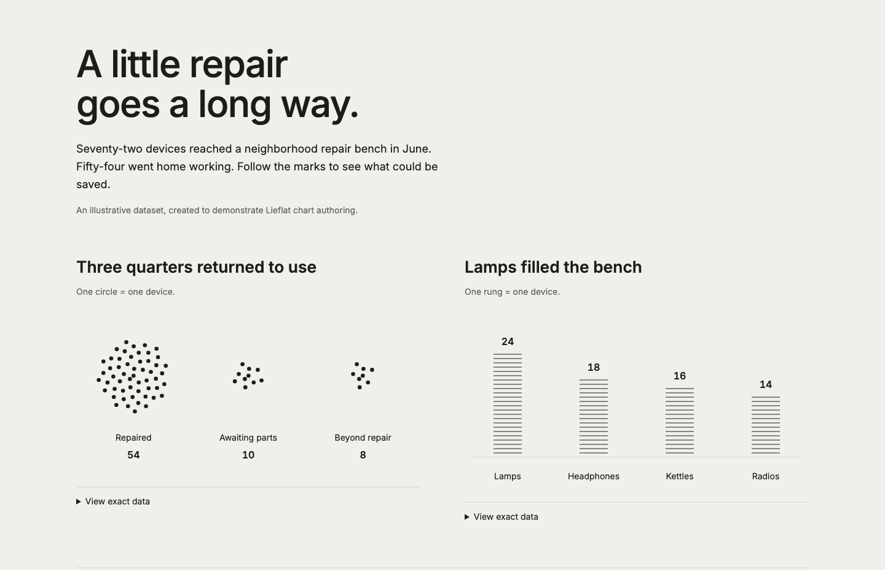

# Examples

Start with the source closest to your question. Page sources export to standalone HTML; chart JSON has its own exporter. Keep shared data beside the source and replace illustrative data before making factual claims.



```bash
npm run ve:export -- examples/visual-explainer-mdx/data-charts.mdx --out dist/charts.html
npm run ve:chart -- examples/visual-explainer-mdx/lieflat-chart.json --out dist/chart.html
```

## Data and systems

| Source | What to learn |
|---|---|
| [data-charts.mdx](visual-explainer-mdx/data-charts.mdx) | Five views of one illustrative repair dataset |
| [repair-story-data.ts](visual-explainer-mdx/repair-story-data.ts) | Derive chart values from shared records |
| [lieflat-chart.json](visual-explainer-mdx/lieflat-chart.json) | Export a chart without MDX |
| [diagram-canvas.mdx](visual-explainer-mdx/diagram-canvas.mdx) | Explain a cache hit and miss with automatic routing |
| [animated-diagram.mdx](visual-explainer-mdx/animated-diagram.mdx) | Author an ordered walkthrough with playback and static stepping |
| [artifacture.architecture.json](visual-explainer-mdx/artifacture.architecture.json) | Author and validate an Archify architecture |
| [explain-diff-demo.mdx](visual-explainer-mdx/explain-diff-demo.mdx) | Connect a code change to its effect on the request path |
| [visual-plan.mdx](visual-explainer-mdx/visual-plan.mdx) | Present implementation decisions and risks |

The repair story follows counts, timing, faults, and outcomes. Edit its records before changing its marks. The [chart guide](../plugins/visual-explainer/references/charts.md) explains each encoding and data contract.

Archify uses its own exporter:

```bash
npm run ve:archify -- setup
npm run ve:archify -- deliver architecture examples/visual-explainer-mdx/artifacture.architecture.json dist/architecture.html --json
```

## Themes and formats

| Source | What to learn |
|---|---|
| [preset-gallery.mdx](visual-explainer-mdx/preset-gallery.mdx) | Compare ISO, 3b1b, Algebrica, and Mono Color |
| [showcase.tsx](visual-explainer-mdx/showcase.tsx) | Explore an agent workflow, calculated attention, a zero-value code fix, and a circle generating a wave |
| [preset-artifact.tsx](visual-explainer-mdx/preset-artifact.tsx) | Theme one queue explanation with `?preset=algebrica` |
| [presentation-deck.tsx](visual-explainer-mdx/presentation-deck.tsx) | Use a fixed stage with supporting detail |
| [slide-deck.mdx](visual-explainer-mdx/slide-deck.mdx) | Build a responsive reader deck |
| [magazine-deck.mdx](visual-explainer-mdx/magazine-deck.mdx) | Arrange a horizontal reading sequence |
| [poster-card.tsx](visual-explainer-mdx/poster-card.tsx) | Stack a Mono Color poster on narrow screens |
| [video-longform.tsx](visual-explainer-mdx/video-longform.tsx) | Reuse three semantic diagrams in a 24-second shared video sequence |

[Request diagram](../docs/img/examples/diagram.png) · [Walkthrough](../docs/img/examples/animated-diagram.png) · [Themes](../docs/img/examples/presets.png) · [Poster](../docs/img/examples/poster.png) · [Presentation](../docs/img/examples/presentation-deck.png) · [Archify](../docs/img/examples/archify.png) · [Algebrica](../docs/img/examples/algebrica.png) · [Mono Color](../docs/img/examples/mono-color.png)

Export shared video sequences with the bundled runtime:

```bash
npm run ve:graphic-video -- examples/visual-explainer-mdx/video-longform.tsx --out dist/video/index.html
```

Keep `index.html` beside its content-hashed JavaScript asset. The example holds each beat for eight seconds and uses hard cuts at 8s and 16s instead of its earlier 0.3s fades. `ve:export-static` remains useful for SSR content checks and source-owned documents; it renders this example's first pose without playback.

For standalone HTML, use the [template guide](../plugins/visual-explainer/templates/README.md). Complete [verification](../plugins/visual-explainer/references/verification.md) before sharing.

## Component catalog

[component-catalog.tsx](visual-explainer-mdx/component-catalog.tsx) previews the actual
copyable diagrams, scene builders, charts, code views, and interactions. Switch
ISO, 3b1b, Mono Color, and Algebrica; seek authored time directly.

```bash
npm run ve:export -- examples/visual-explainer-mdx/component-catalog.tsx --out dist/components.html
```

For composed examples, export [showcase.tsx](visual-explainer-mdx/showcase.tsx).
[showcase-scenes.ts](visual-explainer-mdx/showcase-scenes.ts) combines the existing
graphics, Hairline, sequence, grid, plot, authored-value, and motion APIs. Each
example samples explicit time, supports direct seeking, and holds its final pose.
The attention example calculates a toy softmax; it does not capture a trained
model's attention.

```bash
npm run ve:export -- examples/visual-explainer-mdx/showcase.tsx --out dist/showcase/index.html
```

The optional video gallery reads `clips/clips.json` beside the exported page.
Supply an array with `id`, `title`, `description`, `file`, `poster`, `captions`, and
`duration` fields; media paths are relative to its `clips/` directory. The public preview uses
four narrated excerpts from the rendered Artifacture films. Those media outputs
are separate from the reusable source examples.

The [ISO circuit](visual-explainer-mdx/iso.tsx) demonstrates live face details and Motionmaxxing curves. Its [shared source](visual-explainer-mdx/iso-source.ts) also supplies the [video sequence](visual-explainer-mdx/iso-video.tsx). Export the gallery with `npm run ve:export`; render the sequence with `artifacture fframes` or `npm run ve:graphic-video`. Place the encoded video beside the gallery as `iso-native.mp4`.
